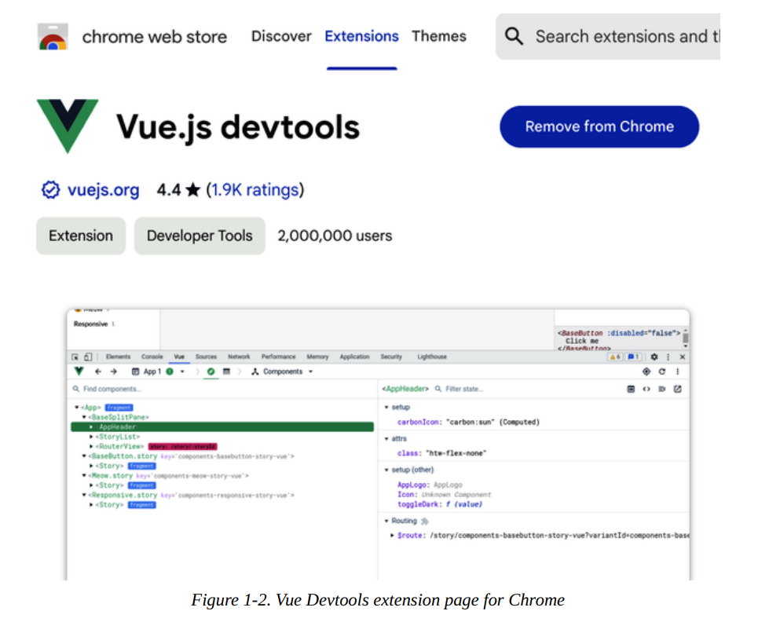

# Welcome to the Vue.js World!

Lanzado inicialmente en 2014, Vue.js ha experimentado una rápida adopción, especialmente en 2018. Vue es un framework popular dentro de la comunidad de desarrolladores, gracias a su facilidad de uso y flexibilidad. Si buscas una excelente herramienta para crear y distribuir aplicaciones web de alto rendimiento a los usuarios finales, Vue.js es la respuesta.

Este capítulo destaca los conceptos clave de Vue.js y te guía a través de las herramientas que necesitas para tu entorno de desarrollo. También explora herramientas útiles que facilitan el proceso de desarrollo. Al finalizar el capítulo, tendrás un entorno de trabajo con una aplicación Vue.js sencilla, lista para comenzar tu aprendizaje de Vue.js.

## ¿Qué es Vue.js?

Vue.js, o Vue, significa vista en francés; es un motor JavaScript para crear interfaces de usuario (UI) progresivas, componibles y reactivas en aplicaciones frontend.

Vue se basa en JavaScript y ofrece un mecanismo organizado para estructurar y construir aplicaciones web. También actúa como transcompilador, compilando y traduciendo el código Vue (como un componente de archivo único, que analizaremos con más detalle en «Estructura de un componente de archivo único de Vue») a código HTML, CSS y JavaScript equivalente durante la compilación, antes del despliegue. En modo independiente (con un archivo de script generado), el motor Vue realiza la traducción del código en tiempo de ejecución.

Vue sigue el patrón MVVM (Modelo-Vista-ViewModel). A diferencia de MVC (Modelo-Vista-Controlador),¹ el ViewModel es el que enlaza los datos entre la Vista y el Modelo. Permitir la comunicación directa entre la Vista y el Modelo habilita progresivamente la reactividad del componente.

En resumen, Vue se creó para centrarse únicamente en la capa de Vista, pero es adaptable de forma incremental para integrarse con otras bibliotecas externas y así lograr usos más complejos.

Dado que Vue se centra exclusivamente en la capa de Vista, facilita el desarrollo de aplicaciones de una sola página (SPA). Las SPA pueden ejecutarse de forma rápida y fluida, comunicando datos continuamente con el backend.

El sitio web oficial de Vue incluye documentación de la API, instrucciones de instalación y casos de uso principales como referencia.

## Beneficios de Vue en el desarrollo web moderno
Una ventaja significativa de Vue es su documentación clara y fácil de entender. Además, el ecosistema y la comunidad de soporte que lo rodean, como Vue Router, Vuex y Pinia, facilitan a los desarrolladores la configuración y ejecución de sus proyectos con mínimo esfuerzo.

Las API de Vue son sencillas y familiares para quienes hayan trabajado con AngularJS o jQuery. Su potente sintaxis de plantillas minimiza el aprendizaje y simplifica el manejo de datos y la escucha de eventos del Modelo de Objetos del Documento (DOM) en la aplicación.

Otro beneficio importante de Vue es su tamaño. El tamaño de un framework influye considerablemente en el rendimiento de la aplicación, especialmente en el tiempo de carga inicial. Actualmente, Vue es el framework más rápido y ligero (aproximadamente 10 kB). Esta ventaja se traduce en una mayor eficiencia, descargas más rápidas y mejor rendimiento en tiempo de ejecución desde la perspectiva del navegador.

Con el lanzamiento de Vue 3, la compatibilidad integrada con TypeScript ofrece a los desarrolladores la ventaja de definir tipos y lograr que su código sea más legible, organizado y fácil de mantener a largo plazo.

## Instalar Node Js
Trabajar con Vue requiere configurar el ecosistema de desarrollo y tener conocimientos previos de programación para seguir el ritmo del aprendizaje. Node.js y NPM (o Yarn) son herramientas de desarrollo necesarias que debes instalar antes de empezar a trabajar en cualquier aplicación.

Node.js (o Node) es un entorno de servidor JavaScript de código abierto basado en el motor de ejecución V8 de Chrome. Node permite a los desarrolladores programar y ejecutar aplicaciones JavaScript localmente o en un servidor, fuera del navegador.

Node es compatible con múltiples plataformas y es fácil de instalar. Si no está seguro de haber instalado Node, abra su terminal (o símbolo del sistema en Windows) y ejecute el siguiente comando:

``` sh
npm -v
```

El resultado debería mostrar la versión de Node o «Comando no encontrado» si Node no está instalado.

Si no ha instalado Node o su versión es inferior a la 12.2.0,
visite el sitio web del proyecto Node y descargue el instalador de la última versión compatible con su sistema operativo (Figura 1-1).

Una vez finalizada la descarga, haga clic en el instalador y siga las instrucciones para configurarlo.

Al instalar Node, además del comando `node`, también se añade el comando `npm` a la línea de comandos. Si escribe el comando `node -v`, debería ver el número de versión instalada.


## El Node Package Manager (NPM)

Es el gestor de paquetes predeterminado para Node. Se instala junto con Node.js de forma predeterminada. Permite a los desarrolladores descargar e instalar fácilmente otros paquetes de Node desde servidores remotos. Vue y otros marcos de trabajo de front-end son ejemplos de paquetes de Node muy útiles.


NPM es una potente herramienta para desarrollar aplicaciones JavaScript complejas, con la capacidad de crear y ejecutar scripts de tareas (para iniciar un servidor de desarrollo local, por ejemplo) y descargar automáticamente las dependencias de los paquetes del proyecto.


De forma similar a la comprobación de la versión de Node, puedes comprobar la versión de NPM mediante el comando `npm`:

`npm -v`. 

Para actualizar tu versión de NPM, usa el siguiente comando: 

`npm install npm@latest -g`. 

Con el parámetro `@latest`, tu herramienta NPM actual se actualiza automáticamente a la última versión. Puedes ejecutar `npm -v` de nuevo para asegurarte de que se ha actualizado correctamente

También puedes reemplazar la palabra `latest` para especificar una versión concreta de NPM (en el formato `xx.x.x`). Además, debes indicar la instalación global con la bandera `-g` para que el comando `npm` esté disponible en todo tu equipo local. Por ejemplo, si ejecutas el comando `npm install npm@6.13.4 -g`, la versión de NPM se actualizará automáticamente.

!!! note "VERSIÓN DE NPM PARA ESTE LIBRO" 
    Recomiendo instalar la versión 7.x de NPM para poder seguir todos los ejemplos de código de NPM en este libro.

Un proyecto Node depende de un conjunto de paquetes Node² (o dependencias) para funcionar correctamente. En el archivo package.json, ubicado en el directorio del proyecto, se encuentran estos paquetes instalados. Este archivo también describe el proyecto, incluyendo el nombre, el/los autor/es y otros comandos de scripting aplicados exclusivamente al proyecto.

Cuando ejecutas el comando `npm install` (o `npm i`) dentro de la carpeta del proyecto, NPM consultará este archivo e instalará todos los paquetes listados en una carpeta llamada `node_modules`, listos para que el proyecto los utilice. Además, creará un archivo `package-lock.json` para controlar la versión de los paquetes instalados y la compatibilidad entre dependencias comunes.

Para iniciar un proyecto desde cero con dependencias, usa el siguiente comando dentro del directorio del proyecto:
`npm init`. Este comando te guiará a través de algunas preguntas relacionadas con el proyecto e inicializará un proyecto vacío con un archivo `package.json` que contiene tus respuestas.

Puedes buscar paquetes de código abierto públicos en el sitio web oficial de NPM.


## Yarn

Si NPM es la herramienta estándar de gestión de paquetes, Yarn es un gestor de paquetes alternativo y muy popular desarrollado por Facebook.³ Yarn es más rápido, más seguro y más fiable gracias a su mecanismo de descarga y almacenamiento en caché en paralelo. Es compatible con todos los paquetes de NPM, por lo que puede utilizarse como sustituto directo de NPM.


Puedes instalar la última versión de Yarn para tu sistema operativo visitando la página web oficial de Yarn.

Si trabajas en un ordenador con macOS y tienes instalado Homebrew,puedes instalar Yarn directamente utilizando el comando

`brew install yarn` 

Este comando instala Yarn y Node.js (si no están disponibles) globalmente.

También puedes instalar Yarn globalmente usando la herramienta de gestión de paquetes NPM con el siguiente comando:

`npm i -g yarn`

Ahora deberías tener Yarn instalado en tu máquina y listo para usar.

Para comprobar si Yarn está instalado y verificar su versión, usa el siguiente comando:

`yarn -v`

Para añadir un nuevo paquete, usa el siguiente comando:

`yarn add <nombre del paquete de Node>` 

Para instalar las dependencias de un proyecto, en lugar de usar `npm install`, solo necesitas ejecutar el comando yarn dentro del directorio del proyecto. Una vez finalizado, al igual que con NPM, Yarn también añadirá un archivo yarn.lock en el directorio de tu proyecto.

!!! note 
    Utilizaremos Yarn como herramienta de gestión de paquetes para el código presentado en este libro.


En este punto, ya has configurado tu entorno de codificación esencial para el desarrollo con Vue. En la siguiente sección, veremos las Herramientas para Desarrolladores de Vue y lo que nos ofrecen para trabajar con Vue.

## Herramientas para Desarrolladores de Vue

Las Herramientas para Desarrolladores de Vue (o Vue Devtools) son las herramientas oficiales que te ayudan a trabajar con tus proyectos de Vue localmente. Estas herramientas incluyen extensiones para Chrome y Firefox, y una aplicación de escritorio Electron para otros navegadores. Deberías instalar una de estas herramientas durante el proceso de desarrollo.

Los usuarios de Chrome pueden ir al enlace de la extensión en la Chrome Web Store e instalar la extensión, tal como se muestra en la figura 1‑2.




Una vez instalada y habilitada la extensión, podrá detectar si algún sitio web utiliza Vue en producción. Cuando un sitio web está construido con Vue, el icono de Vue en la barra de herramientas del navegador se resalta.

Las Vue Devtools te permiten inspeccionar el árbol de componentes Vue, las props y los datos de cada componente, los eventos y la información de enrutado dentro de la consola de desarrollador del navegador. [devtools.vuejs](https://devtools.vuejs.org/getting-started/introduction)

Estas herramientas dividen la información en distintas pestañas, ofreciendo una visión clara y organizada que resulta muy útil para depurar y analizar el comportamiento de cualquier componente Vue dentro de tu proyecto. [digitalocean](https://www.digitalocean.com/community/tutorials/vuejs-vue-devtools)

## Vite.js como herramienta de gestión de compiladores

Presentado en 2020, Vite.js (o Vite) es un servidor de desarrollo JavaScript que
utiliza la importación nativa del módulo ES4 durante el desarrollo en lugar de empaquetar el código en fragmentos de archivos JavaScript como Webpack, Rollup, etc.

!!! note 

    A partir de ahora, utilizaremos el término Vite para referirnos a Vite.js.

Este comportamiento permite a **Vite** realizar un **hot reload** durante el desarrollo a una velocidad impresionante, haciendo la experiencia de desarrollo fluida sin interrupciones.

También ofrece muchas **características listas para usar** como soporte para **TypeScript** y compilación **on-demand**, que está ganando popularidad rápidamente en la comunidad de desarrolladores.

La comunidad de **Vue** ha reemplazado la herramienta **Vue CLI** (que usa **Webpack** internamente) con **Vite** como la herramienta predeterminada para crear y gestionar proyectos Vue. [tms-outsource](https://tms-outsource.com/blog/posts/vue-cli-vs-vite/)

??? info "Vue y vite"

    __Cuando se  dice que vue traduce a html, css y js es porque vite esta detras haciendo ese trabajo ?__

    Exacto, lo entendiste perfecto.

    Cuando la gente dice "Vue compila a HTML, CSS y JS" están simplificando. El proceso real es:

    ```
    Tu código .vue
        ↓
    Vite (hace la traducción)
        ↓
    HTML + CSS + JS puro
        ↓
    El navegador lo entiende
    ```

    Vue como tal es el **framework** — define la sintaxis, la reactividad, cómo funcionan los componentes. Pero Vue solo no llega al navegador. **Vite es el que agarra ese código Vue y lo transforma** en algo que el navegador pueda leer.

    Es una colaboración:

    - **Vue** → define el lenguaje y las reglas
    - **Vite** → hace el trabajo de traducción

    Como si Vue fuera el idioma y Vite fuera el intérprete.

## Crear una nueva aplicación Vue

Con **Vite**, hay varias formas de crear un **nuevo proyecto de aplicación Vue**. La manera más directa es usar la siguiente sintaxis de comando en tu terminal:

```
npm init vue@latest
```

Este comando primero instalará **create-vue**, una herramienta oficial de scaffolding, y luego te presentará una **lista de preguntas esenciales** para configurar tu aplicación Vue. [luisllamas](https://www.luisllamas.es/crear-app-vue/)

Las configuraciones usadas para la aplicación Vue en este libro incluyen:

- **Nombre del proyecto Vue**, en formato **todo en minúsculas**. **Vite** usa este valor para crear un **nuevo directorio de proyecto** anidado en tu directorio actual.
- **TypeScript**: Un lenguaje de programación tipado construido sobre **JavaScript**.
- **JSX**: En el **Capítulo 2**, discutiremos cómo **Vue** soporta escribir código en estándar **JSX** (escribir sintaxis HTML directamente en bloques de código JavaScript).
- **Vue Router**: En el **Capítulo 8**, implementaremos **routing** en nuestra aplicación usando **Vue Router**.
- **Pinia**: En el **Capítulo 9**, discutiremos usar **Pinia** para gestionar y compartir datos a través de la aplicación.
- **Vitest**: Esta es la **herramienta oficial de unit testing** para cualquier proyecto **Vite**, que exploraremos más en el **Capítulo 11**.
- **ESLint**: Esta herramienta verifica tu código según un conjunto de **reglas ESLint**, ayudando a mantener tu estándar de codificación, hacerlo más legible y evitar errores ocultos.
- **Prettier**: Esta herramienta **formatea automáticamente** los estilos de tu código para mantenerlo limpio, hermoso y siguiendo un **estándar de codificación**.

```sh
application_vue> npm init vue@latest

> npx
> create-vue

┌  Vue.js - The Progressive JavaScript Framework
│
◇  Project name (target directory):
│  → learning-vue-app
│
◇  Use TypeScript?
│  → Yes
│
◇  Select features to include in your project: (↑/↓ to navigate, space to select, a to toggle all, enter to confirm) 
│  
│ [✓] JSX Support, 
│ [✓] Router (SPA development), 
│ [✓] Pinia (state management), 
│ [✓] Vitest (unit testing), 
│ [X] End-to-End (unit testing)
│ [✓] Linter (error prevention), 
│ [✓]  Prettier (code formatting)
│
◇  Select experimental features to include in your project: (↑/↓ to navigate, space to select, 
│  a to toggle all, enter to confirm)
│  → none
│
◇  Skip all example code and start with a blank Vue project?
│  → No

Scaffolding project in C:\Learnings\backend-learnings-projects\learning-vue-examples\capitulo-1\a_new_application_vue\learning-vue-app...
│

```

Tras recibir la configuración deseada, create-vue genera la estructura básica del proyecto.
Una vez finalizado, mostrará una serie de comandos en orden para que los ejecutes y pongas en marcha tu proyecto localmente.

``` bash
└  Done. Now run:

   cd learning-vue-app
   npm install
   npm run format
   npm run dev

| Optional: Initialize Git in your project directory with:

   git init && git add -A && git commit -m "initial commit"
```
A continuación, exploraremos la estructura de archivos de nuestro proyecto recién creado.

## Estructura del repositorio de archivos

Un nuevo proyecto de Vue contiene la siguiente estructura inicial dentro del directorio src:

`assets`

:   Carpeta donde se pueden colocar las imágenes, gráficos y archivos CSS del   proyecto.

`components`

:   Carpeta donde se crean y escriben los componentes Vue
siguiendo el concepto de Componente de Archivo Único (SFC).

`router`

:   Carpeta donde se almacenan todas las configuraciones de enrutamiento.

`stores`

:   Carpeta donde se crean y gestionan los datos globales del proyecto mediante
Pinia.

`views`

:   Carpeta donde se almacenan todos los componentes Vue que se vinculan a las rutas definidas.

`App.vue`

:   El componente principal de la aplicación Vue actúa como raíz para alojar todos los demás componentes Vue dentro de la aplicación.

`main.ts`

:   Contiene el código TypeScript responsable de montar el componente raíz (App.vue) en un elemento HTML en la página DOM. Este archivo también es donde se configuran los plugins y las bibliotecas de terceros en la aplicación, como Vue Router, Pinia, etc.

??? info "Comando run"

    En resumen:

    - `run` es como cualquier otro __subcomando__ definido en npm cuyo trabajo específico es buscar y ejecutar scripts del`package.json`
    - npm tien otros subcomandos como `install` `init` `uninstall`
    - Solo `start`, `test` y `stop` son atajos que no necesitan `run`
    - Todo lo demás — sin importar si es proyecto Node, Vue, o cualquier otro — necesita `npm run <script>`".

En el directorio raíz del proyecto se encuentra el archivo index.html, que es el punto de entrada para cargar la aplicación en el navegador. Este archivo importa el archivo main.ts mediante la etiqueta `<script>` y proporciona el elemento de destino para que el motor de Vue cargue la aplicación ejecutando el código de main.ts. Es probable que este archivo permanezca sin cambios durante el desarrollo.  asdasd

Puedes encontrar todo el código de ejemplo en el repositorio de GitHub dedicado. Hemos organizado estos archivos de código por capítulos.

## SUMARY
En este capítulo, aprendimos sobre los beneficios de Vue y cómo instalar las herramientas esenciales para nuestro entorno de desarrollo. También hablamos de las herramientas para desarrolladores de Vue y otras herramientas para crear proyectos de Vue de manera efectiva, como Vite. Ahora que hemos creado nuestro primer proyecto de Vue, estamos listos para aprender Vue, comenzando por lo básico: la instancia de Vue, las directivas integradas y cómo Vue maneja la reactividad.
