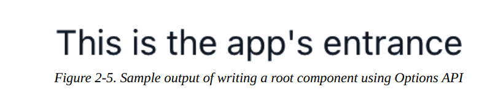
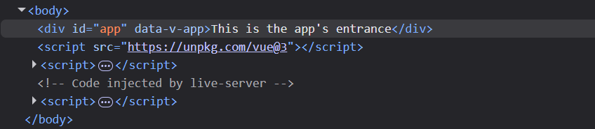
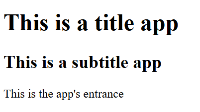
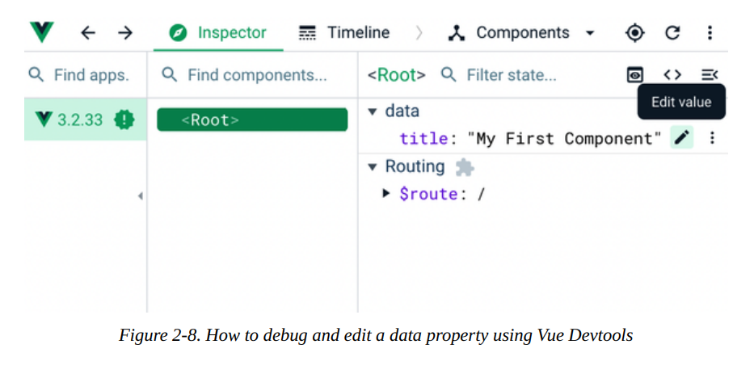
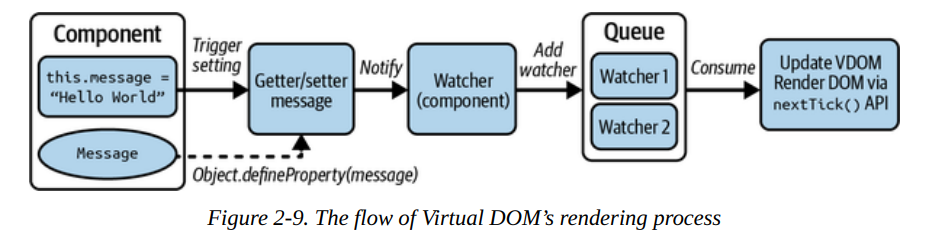
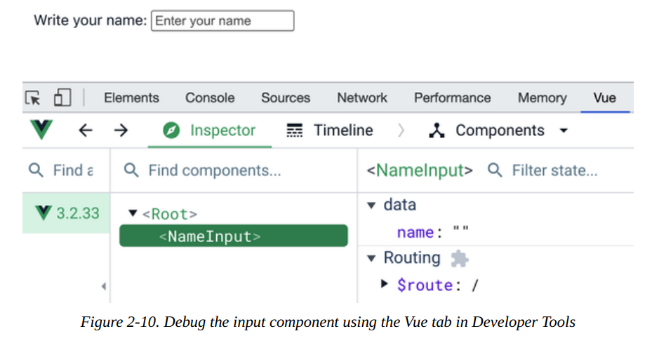
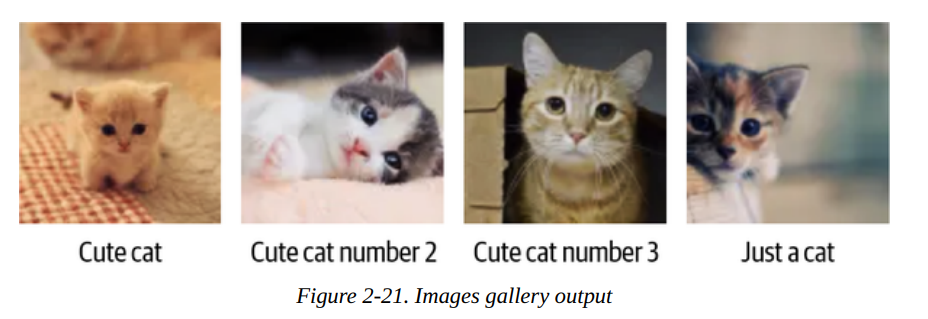

# How Vue Works: The Basics

En el capítulo anterior, aprendiste las **herramientas esenciales** para construir una aplicación **Vue** y creaste tu **primera aplicación Vue**, preparándote para el siguiente paso: aprender **cómo funciona Vue** escribiendo código Vue.

Este capítulo te introduce a los conceptos de **Virtual Document Object Model (Virtual DOM)** y los fundamentos de escribir un **componente Vue** con **Vue Options API**. También explora **directivas Vue adicionales** y el **mecanismo de reactividad de Vue**. Al final del capítulo, entenderás **cómo funciona Vue** y podrás **escribir y registrar un componente Vue** para usarlo en tu aplicación.

## DOM virtual bajo el capó

Vue no trabaja directamente con el Modelo de Objetos del Documento (DOM).En su lugar, implementa su propio DOM Virtual para optimizar el rendimiento de la aplicación en tiempo de ejecución.

Para comprender a fondo cómo funciona el DOM Virtual, comenzamos con el concepto de DOM.

El DOM representa el contenido del documento HTML (o XML) en la web, en forma de una estructura de datos en memoria con forma de árbol. Actúa como una interfaz de programación que conecta la página web con el código de programación (como JavaScript). Las etiquetas, como `<div>` o `<section>`, en el documento HTML se representan como nodos y objetos programáticos.


Después de que el navegador analiza el documento HTML, el DOM estará disponible para interacción inmediatamente. Ante cualquier cambio de diseño, el navegador pinta y repinta el DOM constantemente en segundo plano. A este proceso de analizar y pintar el DOM lo llamamos rasterización o el pipeline de píxel a pantalla. La figura 2-2 muestra cómo funciona la rasterización.


### El problema de la actualización del diseño

Cada renderizado supone un coste para el rendimiento del navegador. Dado que el DOM puede constar de muchos nodos, consultar y actualizar uno o varios nodos puede resultar extremadamente costoso. He aquí un ejemplo sencillo de una lista de elementos `<li>` en el DOM:

```html linenums="1"
ul class="list" id="todo-list">
    <li class="list-item">To do item 1</li>
    <li class="list-item">To do item 2</li>
    <!--so on…-->
</ul>
```

**Agregar/quitar** un elemento `<li>` o **modificar su contenido** requiere **consultar el DOM** para ese elemento usando **`document.getElementById`** (o **`document.getElementsByClassName`**). Entonces necesitas **llevar acabo las actualizaciones deseadas** usando las **APIs apropiadas del DOM**.

Por ejemplo, si quieres **agregar un nuevo ítem** al ejemplo anterior, necesitas hacer los siguientes pasos:

1. **Consultar el elemento de la lista** por el valor de su atributo `id` —"todolist".

2. **Agregar el nuevo elemento `li`** usando **`document.createElement()`**.

3. **Establecer el `textContent`** y los **atributos relevantes** para que coincidan con el estándar de los otros elementos usando **`setAttribute()`**.

4. **Agregar ese elemento a la lista que lo contiene** encontrada en el paso 1 como su hijo usando **`appendChild()`**.

```js linenums="1"
const list = document.getElementById('todo-list');
const newItem = document.createElement('li');
newItem.setAttribute('class', 'list-item');
newItem.textContent = 'To do item 3';
list.appendChild(newItem);
```

Similarmente, supongamos que quieres **cambiar el contenido de texto** del **2º elemento `li`** a **"buy groceries"**. En ese caso, realizas el **paso 1** para obtener el **elemento de la lista que lo contiene**, luego buscar el **elemento de destino** usando **`getElementsByClassName()`**, y finalmente cambias su **`textContent`** al **nuevo contenido**.

```js linenums="1"
const secondItem = list.getElementsByClassName('list-item')[1];
secondItem.textContent = 'Buy groceries
```

**Consultar y actualizar el DOM** a **pequeña escala** generalmente **no impacta enormemente el rendimiento**.  Sin embargo, estas acciones **pueden ralentizar la página** si se realizan de manera **repetitiva** (en pocos segundos) y en una **página web más compleja**. El **impacto en el rendimiento es significativo** cuando hay **actualizaciones menores consecutivas**. Muchos frameworks, como **Angular 1.x**, **no reconocen ni abordan** este problema de rendimiento a medida que **crece la base de código**. El **Virtual DOM** está diseñado para **solucionar el problema de actualización del layout**.

## What Is Virtual DOM?

El __DOM virtual__ es una copia virtual en memoria del __DOM real__ del
navegador, pero es más ligero y cuenta con funcionalidades adicionales

**Imita la estructura del DOM real**, con una **estructura de datos diferente** (usualmente un **Objeto**) (ver Figura 2-3). [styde](https://styde.net/que-es-el-virtual-dom-en-react/)


De tras de escenas, el **Virtual DOM** aún usa la **API del DOM** para **construir y renderizar** elementos actualizados en el navegador. Por lo tanto, **sigue provocando el proceso de repintado** del navegador, pero **de forma más eficiente**.

En resumen, el **Virtual DOM** es un **patrón abstracto** que busca **liberar al DOM** de todas las acciones que pueden llevar a **ineficiencias de rendimiento**, como **manipular atributos**, **manejar eventos** y **actualizar manualmente elementos del DOM**.

## How Virtual DOM Works in Vue

El **Virtual DOM** se sitúa **entre el DOM real** y el **código de la aplicación Vue**. A continuación se muestra un **ejemplo** de cómo se ve un **nodo en el Virtual DOM**:

```js linenums="1"
const node = {
tag: 'div',
attributes: [{ id: 'list-container', class: 'list-container' }],
children: [ /* an array of nodes */]
}
```

Llamemos a este nodo **VNode**. El **VNode** es un **nodo virtual** que reside dentro del **Virtual DOM** y representa el **elemento del DOM real** en el DOM real. 

A través de **interacciones con la UI**, el usuario le dice a **Vue** en qué **estado desea** que esté el elemento; **Vue** entonces activa el **Virtual DOM** para actualizar el **objeto (nodo)** a la forma deseada, mientras **registra esos cambios**. 

Finalmente, se comunica con el **DOM real** y realiza **actualizaciones precisas** en los nodos modificados. 

Dado que el **Virtual DOM** es un **árbol de objetos JavaScript personalizados**, actualizar un componente equivale a actualizar un **objeto JavaScript personalizado**. Este proceso **no toma mucho tiempo**. 

Como **no llamamos a ninguna API del DOM**, esta acción de actualización **no provoca un repintado del DOM**. Una vez que el **Virtual DOM** termina de actualizarse, se **sincroniza en lote** con el **DOM real**, llevando los cambios a reflejarse en el navegador. 

La **Figura 2-4** ilustra cómo funcionan las actualizaciones del **Virtual DOM** al **DOM real** cuando se agrega un nuevo ítem de lista y se cambia el texto del ítem de lista.


Dado que el **Virtual DOM** es un **árbol de objetos**, podemos **rastrear fácilmente** las **actualizaciones específicas** que necesitan sincronizarse con el **DOM real** al modificar el Virtual DOM. 

En lugar de **consultar y actualizar directamente** en el **DOM real**, ahora podemos **programar y llamar** las APIs actualizadas con una **única función de renderizado** en **un ciclo de actualización** para mantener la **eficiencia del rendimiento**. 

Ahora que entendemos cómo funciona el **Virtual DOM**, exploraremos la **instancia de Vue** y la **Vue Options API**.

## The Vue App Instance and Options API

Toda **aplicación Vue** comienza con una **única instancia de componente Vue** como **raíz de la aplicación**. Cualquier **otro componente Vue** creado en la misma aplicación necesita **anidarse dentro** de este **componente raíz**.

!!! note

    Puedes encontrar el **ejemplo de código de inicialización** en **`main.ts`** de nuestro proyecto Vue. **Vite genera automáticamente** el código como parte de su **proceso de scaffolding**. También encontrarás el **ejemplo de código de este capítulo** dentro de este archivo.

En Vue 2, Vue expone una clase Vue (o función JavaScript) para que puedas crear una instancia de componente Vue a partir de un conjunto de opciones de configuración, utilizando la siguiente sintaxis:

```js linenums="1"
const App = {
//component's options
}
const app = new Vue(App)
```

**Vue** recibe un **componente**, o más precisamente, la **configuración del componente**. La **configuración de un componente** es un **Objeto** que contiene todas las **opciones de configuración iniciales** del componente. Llamamos a la estructura de este argumento **Options API**, que es **otro de los APIs centrales de Vue**. 

A partir de **Vue 3**, ya **no puedes llamar directamente** a `new Vue()`. En su lugar, creas la **instancia de la aplicación** usando el método **`createApp()`** del paquete `vue`. Este cambio en la funcionalidad **mejora el aislamiento** de cada instancia Vue creada tanto en **dependencias** como en **componentes compartidos** (si los hay) y la **legibilidad del código**.

```js linenums="1"
import { createApp } from 'vue'
const App = {
//component's options
}
const app = createApp(App)
```

`createApp()` también acepta un objeto con las configuraciones del componente. En función de estas configuraciones, Vue crea una instancia de componente Vue como aplicación raíz `app`. A continuación, debes montar el componente raíz `app` en el elemento HTML deseado utilizando el método `app.mount()`, de la siguiente forma:

```js linenums="1"
app.mount('#app')
```

`#app` es el selector de id único para el elemento raíz de la aplicación. El motor de Vue busca ese elemento usando este id, monta la instancia de la aplicación en él y luego renderiza la aplicación en el navegador. El siguiente paso es proporcionar las configuraciones para que Vue cree una instancia de componente según la API de opciones (Options API).

!!! note

    A partir de este momento, escribimos código de acuerdo con los estándares de la API de Vue 3.

## Exploring the Options API

La API de opciones (Options API) es la API central de Vue para inicializar un componente Vue. Contiene las configuraciones del componente estructuradas en formato de objeto. Nosotros dividimos sus propiedades esenciales en cuatro categorías principales:

`State handling` 

:   Incluye `data()`, que devuelve el estado de datos local del componente, `computed`, `methods` y `watch` para habilitar la observación en datos locales específicos, y `props` para los datos entrantes. [vueschool](https://vueschool.io/articles/vuejs-tutorials/options-api-vs-composition-api/)

`Rendering`  

:   Incluye `template` para la plantilla HTML de la vista, y `render()` como la lógica de renderizado del componente. [dev](https://dev.to/sucodelarangela/vue3-options-api-vs-composition-api-en-1fbo)

`Lifecycle hooks` 

:   Tales como, `beforeCreate()`, `created()`, `mounted()`, etc., que sirven para gestionar diferentes etapas del ciclo de vida de un componente. [dev](https://dev.to/sucodelarangela/vue3-components-lifecycle-en-10e)

`Others`

:   Incluye `provide()` e `inject()` para manejar las diferentes personalizaciones y la comunicación entre componentes., y `components`, una colección de plantillas de componentes anidados que se pueden usar dentro del componente. [vuejs](https://vuejs.org/guide/components/provide-inject)

El siguiente listado es un ejemplo de la estructura de nuestro componente raíz `App` basada en la Options API.

```js linenums="1"
import { createApp } from 'vue'
const App = {
template: "This is the app's entrance",
}
const app = createApp(App)
app.mount('#app')
```

En el código anterior, una plantilla HTML muestra texto normal. También podemos definir un estado de datos local usando la función `data()`, que veremos con más detalle en «Creación de estado local con propiedades de datos».

También puedes reescribir el código anterior para usar la función `render()`:

```js linenums="1"
import { createApp } from 'vue'

const App = {
    render() {
    return "This is the app's entrance"
  }
}
const app = createApp(App)
app.mount('#app')
```

Ambos códigos generarán el mismo resultado 



Si abres la pestaña "Elements" (Elementos) en las herramientas de desarrollador del navegador, verás que el DOM real ahora contiene un `div` con `id="app"` y un contenido de texto "This is the app’s entrance" 



También puedes crear un componente nuevo, `Description`, que renderice un texto estático y lo pase a los componentes del `App`. Luego puedes usarlo como un componente anidado en la plantilla.

!!! example "Insertar de componente en el App"

    === "Sin SFC (Options API + template en string)"
    
        ```js linenums="1"
        import { createApp } from 'vue'

        // Crea el componente
        const Description = {
        template: "This is the app's entrance" // (1)!
        };

        const App = {
        // Registra el componente
        components: { Description },

        //Lo encuentra en el template
        template: '<Description />'
        }
        const app = createApp(App)
        app.mount('#app')
        ```

        1. Esto es un `template en string`

    === "Con SFC (Composition API + script setup)"

        ```js linenums="1"

        // Logica del componente, se define: varibles, funciones e imports
        <script setup> 
            import Description from './components/Description.vue'; 
        </script>
        
        //Estructura HTML
        <template>      
            <Description/>
        </template>

        // Estilos del componente (CSS) 
        <style scoped></style> 
        ```

       
La salida sigue siendo la misma que en la figura 2‑6. 

Observa que aquí debes declarar bien `template` o bien la función `render()` (véase “La función render y JSX”) para el componente. Sin embargo, no necesitas estas propiedades si estás escribiendo el componente con el estándar Single File Component (SFC). Trataremos este estándar de componentes en el capítulo 3. A continuación, veamos la sintaxis de la propiedad `template`.

## The Template Syntax

En la Options API, `template` acepta una sola cadena de texto que contiene código HTML válido y representa el componente de la interfaz de usuario. El motor de Vue parsea este valor y lo compila en código JavaScript optimizado, luego genera los elementos del DOM correspondientes. [vuejs](https://vuejs.org/guide/essentials/template-syntax)

El siguiente código muestra nuestro componente raíz `App`, cuyo diseño es un solo `div` que muestra el texto “This is the app’s entrance”:

```js linenums="1"
import { createApp } from 'vue'
const App = {
template: "<div>This is the app's entrance</div>",
}
const app = createApp(App)
app.mount('#app')
```

Para código de plantilla HTML de varios niveles, podemos usar caracteres de acento grave (plantillas literales de JavaScript), denotados por el símbolo `` ` ``, y así mantener la legibilidad. Podemos reescribir la plantilla de `App` en el ejemplo anterior para incluir otros elementos `h1` y `h2`, como en el siguiente caso:

```js linenums="1"
import { createApp } from 'vue'
const App = {
template: `
<h1>This is the app's entrance</h1>
<h2>We are exploring template syntax</h2>
`,
}
```
El motor Vue renderizará en el DOM con dos encabezados



La sintaxis de la propiedad `template` es esencial para crear el vinculo entre un elemento DOM específico y los datos locales del componente, utilizando directivas y una sintaxis dedicada. A continuación exploraremos cómo definir los datos que queremos mostrar en la interfaz de usuario.

## Creating Local State with Data Properties

La mayoría de los componentes mantienen su estado local (o datos locales) o reciben datos desde una fuente externa. En Vue, nosotros almacenamos el estado local del componente usando la propiedad `data()` de la Options API. 

`data()` es una función anónima que devuelve un objeto que representa el estado de los datos locales del componente. A ese objeto devuelto lo llamamos **objeto de datos**. Cuando inicializa la instancia del componente, el motor de Vue añade cada propiedad de este objeto de datos a su sistema de reactividad para rastrear sus cambios y disparar la re‑renderización de la plantilla de la interfaz cuando sea necesario. En resumen, el objeto de datos es el estado reactivo de un componente. 

Para inyectar una propiedad de `data` en la plantilla usamos la sintaxis de “mustache”, denotada por las llaves dobles `{{}}`. Dentro de la plantilla HTML, envolvemos la propiedad de datos con las llaves allí donde necesitamos inyectar su valor. 

```js linenums="1"
import { createApp } from 'vue'
type Data = {
    title: string;
}
const App = {
        template: `<div>{{ title }}</div>`, 
        data(): Data { //(1)!
        return {
            title: 'My first Vue component'
        }
    }
}
const app = createApp(App)
app.mount('#app')
```

1. Define que datos existen en el componentes, no envia datos a `template` , `data()` declara las variables que el `template` puede usar. Ejm: title, name, edad, etc.. Y siempre debe __retornar un objeto__(plain object), esto es lo que vue espera para convertir cada propiedad del objeto en una variable reactiva.
   
En el código anterior declaramos la propiedad de datos local `title` y en la plantilla de `App` inyectamos su valor utilizando la expresión `{{ title }}`. El resultado en el DOM equivale al siguiente código:

```html linenums="1"
<div>My first Vue component</div>
```
También puede combinar un texto estático en línea con llaves dobles dentro
la misma etiqueta de elemento:

```js linenums="1"
onst App = {
template: `
<div>Title: {{ title }}</div>
`,
/**... */
}
```
Vue automáticamente conserva  el texto estático y solo reemplaza la expresión por el valor correcto. El resultado equivale al siguiente código:

```html linenums="1"
<div>Title: My first Vue component</div>
```
Todas las propiedades del objeto de datos están disponibles para ser accedidas directamente e internamente a través de la instancia del componente, `this`. Y `this` es accesible en cualquier método local del componente, propiedades `computed` y hook de ciclo de vida. 

Por ejemplo, podemos imprimir `title` en la consola después de crear el componente usando el hook `created()`:

```js linenums="1"
import { createApp, type ComponentOptions } from 'vue'
const App = {
   /**... */
   created() {
      console.log((this as ComponentOptions<Data>).title)
   }
}
const app = createApp(App)
app.mount('#app')
```
!!! note
    Hacemos un *casting* de `this` al tipo `ComponentOptions`. Habilitaremos soporte completo de TypeScript para el componente Vue en Vue 3 mediante `defineComponent`, del cual hablaremos más adelante en “Usar `defineComponent()` para el soporte de TypeScript”.

Puedes depurar la reactividad de una propiedad de datos usando Vue Devtools. En la página principal de nuestra aplicación, abre las Developer Tools del navegador, ve a la pestaña Vue y selecciona el componente raíz que se muestra en el panel Inspector. Una vez seleccionado, aparecerá un panel lateral que muestra las propiedades del objeto de datos del componente. Al pasar el ratón sobre la propiedad `title`, aparecerá un icono de lápiz que te permitirá editar su valor.



Haz clic en ese botón de edición, modifica el valor de `title` y pulsa Enter; la interfaz de la aplicación refleja inmediatamente el nuevo valor. Has aprendido cómo usar `data()` y las llaves dobles `{{}}` para inyectar los datos locales en la plantilla de la interfaz de usuario. Este es un tipo de **enlace de datos unidireccional (one‑way data binding)**.  

Antes de explorar el enlace bidireccional y otras directivas en Vue, vamos a ver cómo funciona la reactividad en Vue.

## How Reactivity in Vue Works

Para entender cómo funciona la reactividad, echemos un vistazo rápido a cómo el Virtual DOM procesa toda la información recibida, crea y sigue la pista de los VNodes creados antes de reflejarse finalmente en el DOM real.



Podemos describir el proceso del diagrama anterior de la siguiente manera:

1. Una vez que defines la data local, en Vue.js 2.0, el motor interno de Vue utiliza el método integrado `Object.defineProperty()`  de JavaScript para establecer getters y setters para cada pieza de datos relacionada _(la propiedades de data( return {propiedad-1,propiedad-2}))_ y habilitar así la reactividad de esos datos. En Vue.js 3.0, el motor de Vue emplea un mecanismo basado en `Proxy` de ES5 para mejorar el rendimiento, duplicando el rendimiento en tiempo de ejecución y reduciendo a la mitad la memoria necesaria. Explicaremos más sobre este mecanismo de reactividad en el capítulo 3.  

2. Despues de configurar el mecanismo de reactividad, el motor de Vue utiliza objetos *watcher* para seguir cualquier actualización de datos disparada por los setters. Los *watchers* ayudan al motor de Vue a detectar esos cambios y a actualizar el Virtual DOM y el DOM real a través del sistema de cola (Queue).

3. Vue usa el sistema de cola para evitar actualizaciones múltiples e ineficientes del DOM en un periodo corto de tiempo. Cuando cambian los datos de un componente relacionado, el *watcher* correspondiente se añade a la cola. El motor de Vue la ordena de forma específica para su procesamiento. Hasta que el motor de Vue termine de consumir y vaciar ese *watcher* de la cola, solo existirá un *watcher* de ese mismo componente en la cola, independientemente del número de cambios de datos. Este proceso de consumo se realiza mediante la API `nextTick()`, que es una función de Vue.  

4. Finalmente, una vez que el motor de Vue ha consumido y vaciado todos los *watchers*, ejecuta la función `run()` de cada uno para actualizar automáticamente el DOM real y el Virtual DOM del componente, y la aplicación se renderiza.

Vamos a realizar otro ejemplo. Esta vez usaremos `data()` y la ayuda de `created()` para demostrar la reactividad en la aplicación. `created()` es un lifecycle hook que el motor de Vue dispara después de crear la instancia del componente y antes de montarla en el elemento del DOM. En este punto no discutiremos este hook, sino que lo usaremos para realizar una actualización temporal de una propiedad de datos `counter` utilizando `setInterval`:

```ts linenums="1"
import { createApp, type ComponentOptions } from 'vue'
type Data = {
  counter: number;
}
const App = {
template: `<div>Counter: {{ counter }}</div>`,
data(): Data {
  return {
   counter: 0
  }
},
created() {
   const interval = setInterval(() => {
   (this as ComponentOptions<Data>).counter++
   }, 1000);
   setTimeout(() => {
    clearInterval(interval)
   }, 5000)
 }
}
const app = createApp(App)
app.mount('#app')
```

Este código incrementa `counter` cada segundo. También usamos `setTimeout()` para limpiar el intervalo pasado 5 segundos. En el navegador puedes ver que el valor mostrado cambia de 0 a 5 cada segundo. La salida final será igual a la cadena:

```sh
Counter: 5
```
Tras comprender el concepto de reactividad y renderizado en Vue, estamos listos para explorar cómo realizar el enlace de datos bidireccional.

## Two-Way Binding with v-model

El enlace bidireccional se refiere a cómo sincronizamos los datos entre la lógica de un componente y su plantilla de vista. Cuando un campo de datos de un componente cambia programáticamente, el nuevo valor se refleja en su interfaz de usuario. Y viceversa, cuando un usuario modifica el campo de datos en la interfaz de usuario, el componente obtiene y guarda automáticamente el valor actualizado, manteniendo sincronizadas tanto la lógica interna como la interfaz de usuario. Un buen ejemplo de enlace bidireccional es el campo de entrada de un formulario.

El enlace de datos bidireccional es un caso de uso complejo pero beneficioso para el desarrollo de aplicaciones. Un escenario común para el enlace bidireccional es la sincronización de la entrada de formularios. Una implementación adecuada ahorra tiempo de desarrollo y reduce la complejidad para mantener la coherencia de los datos entre el DOM y los datos de los componentes. Sin embargo, implementar el enlace bidireccional es un desafío.

Afortunadamente, Vue simplifica enormemente el enlace bidireccional con la directiva `v-model`.Enlazar la directiva `v-model` al modelo de datos de un componente activará automáticamente la actualización de la plantilla cuando cambie el modelo de datos y viceversa.

La sintaxis es sencilla: el valor que se pasa a `v-model` es el nombre del alias declarado en el objeto `data` de retorno.

Supón que tenemos un componente `NameInput` que recibe una entrada de texto del usuario, con el siguiente código de plantilla:

```js linenums="1"
const NameInput = {
template: `
<label for="name">
<input placeholder="Enter your name" id="name">
</label>`
}
```

Queremos sincronizar el valor de entrada recibido con un modelo de datos local,
llamado nombre. Para ello, añadimos `v-model="nombre"` al elemento de entrada y
declaramos el modelo de datos en `data()` según corresponda:

```js linenums="1"
const NameInput = {
template: `
<label for="name">
Write your name:
 <input
  v-model="name"
  placeholder="Enter your name"
  id="name">
</label>`,
data() {
    return {
        name: '',
    }
 }
}
```

El valor del nombre cambiará cada vez que el usuario modifique el campo de entrada
en tiempo de ejecución.

Para que este componente se rederise en el navegador, añadimos NameInput como uno de los componentes de la aplicación:

```js linenums="1"
import { createApp } from 'vue'
const NameInput = {
/**... */
}
const app = createApp({
components: { NameInput },
template: `<NameInput />`,
})
app.mount('#app')
```

Puedes seguir el cambio de datos abriendo la pestaña Vue en las Herramientas para desarrolladores del navegador. Dentro de la pestaña Inspector, busca y selecciona el elemento NameInput, que se encuentra debajo del elemento Root. Verás los datos del componente en el panel derecho de la pestaña Vue.



Cuando modifique el campo de entrada, la propiedad "nombre" que aparece en "Datos mostrados" en el lado derecho de la pestaña Vue también recibirá el valor actualizado.

Puedes usar el mismo método para crear una lista de verificación con múltiples opciones. En este caso, debes declarar el modelo de datos como un array y agregar el enlace v-model a cada campo de entrada de casilla de verificación.

muestra cómo se ve para un `CourseChecklist`.

```js title="Create a course checklist using v-model and checkbox input" linenums="1"

import { createApp } from 'vue'
const CourseChecklist = {
    template: // (1)!`
   <div>The course checklist: {{list.join(', ')}} </div>
      <div>
        <label for="chapter1">
            <input v-model="list" type="checkbox", value="chapter01" id="chapter1">
            Chapter 1
        </label>
        <label for="chapter2">
            <input v-model="list" type="checkbox", value="chapter02" id="chapter2">
            Chapter 2
        </label>
        <label for="chapter3">
            <input v-model="list" type="checkbox", value="chapter03" id="chapter3">
            Chapter 3
        </label>
      </div>`,
    data(){
        return { list: [] }
    }

}

const App = {
    components: {CourseChecklist},
    template: '<CourseChecklist />'
}
const app =  createApp(App)
app.mount("#app")
```

1. El compilador de Vue transforma el HTML de la `template` en esto:
   ```js linenums="1"
    render() {
    return h('label', { for: 'name' }, [
        'Write your name:',
        h('input', {
          id: 'name',
          placeholder: 'Enter your name',
          value: this.name,
          onInput: e => this.name = e.target.value
        })
      ])
    }
   ```
   `h()` es una función que crea elementos virtuales (Virtual DOM). <br>
   Cuando el compilador genera: `h('div')`, no crea un `<div>` real, crea un objeto en memoria, el compilador tambien genera la funcion `render()` y su codigo JS.
   
    !!! example
        Luego `Render()` retorna una estructura VNode (objeto Java Script) al Virtual DOM (conjunto de varios VNodes), es decir trasforma el codigo de arriba, que genero el compilador de Vue en algo como esto y lo luego lo retorna.
        === "VNode"

            ```js linenums="1"
            {
                type: 'label',
                props: { for: 'name' },
                children: [
                'Write your name:',
                {
                    type: 'input',
                    props: {
                    id: 'name',
                    placeholder: 'Enter your name',
                    value: 'Alex', // ← valor actual de this.name
                    onInput: e => this.name = e.target.value
                    }
                }]
            }
            ```

        === "Estructura VNode"
            
            ```js
            {
                type: 'div',
                props: {},
                children: []
            }
            ```
   Y recuerda que los elementos del Virtual DOM son objetos JavaScript (VNode). Vue compila el `template` en una función `render()`, la cual al ejecutarse construye el VNode que representa la UI.
   
Vue agrega o elimina automáticamente un valor de entrada a la lista según la interacción del usuario.


## Usando el modificador v-model.lazy

Actualizar un valor de datos con cada pulsación de tecla del usuario puede ser excesivo, especialmente cuando se muestra ese valor en otros lugares. Recuerda que Vue vuelve a renderizar la interfaz de usuario de la plantilla según los cambios en los datos. Al habilitar la sincronización bidireccional con cada pulsación de tecla, expones tu aplicación a un posible renderizado innecesario.

Para reducir esta sobrecarga, puede usar el modificador `v-model.lazy` en lugar del `v-model` habitual para vincularlo con el modelo de datos.

```js linenums="1"
const NameInput = {
    template: `
    <label for="name">
    Write your name:
    <input v-model.lazy="name" placeholder="Enter your name" id="name">
    </label>`,
    data() {
    return {
    name: '',
    }
  }
}
```
Este modificador garantiza que el modelo virtual solo registre los cambios activados por el evento onChange de ese elemento de entrada.

!!! note "USING `V-MODEL.NUMBER` AND `V-MODEL.TRIM` - MODIFIERS"
    Si el modelo de datos al que se vincula `v-model` debe ser de tipo numérico, puede usar el modificador `v-model.number` para convertir el valor de entrada a un número. Del mismo modo, si desea asegurarse de que el modelo de datos de cadena no contenga espacios en blanco al final, puede usar `v-model.trim`.

Eso es todo sobre el enlace bidireccional. A continuación examinaremos la directiva más común, `v-bind`, para el enlace unidireccional.

## Vinculando datos reactivos y pasando datos de props con `v-bind`

Anteriormente aprendimos a usar `v-model` para el enlace bidireccional y las llaves dobles `{{}}` para la inyección unidireccional de datos. Pero para realizar una vinculacion unidireccional de datos a otro elemento, ya sea como valores de atributos o a otros componentes Vue como *props*, usamos `v-bind`.

`v-bind`, denotado por `:`, es la directiva de Vue más utilizada en cualquier aplicación. Podemos enlazar el atributo de un elemento (o las *props* de un componente) a una o más expresiones de JavaScript, siguiendo esta sintaxis:

``` js linenums="1"
v-bind:<attribute>="<expression>"
```
O, en resumen, con la sintaxis:

```js linenums="1"
:<attribute>="<expression>"
```
Por ejemplo, tenemos el dato `imageSrc`, una URL de imagen. Para mostrar la imagen usando la etiqueta ``, realizamos la vinculacion con su atributo `src`:

```js title="Ejemplo 2-4. Vinculando un recurso a una imagen" linenums="1"
import { createVue } from 'vue'
const App = {
template: ``,
data() {
    return {
       imageSrc: "https://res.cloudinary.com/mayashavin/image/upload/TheCute%20Cat"
    }
  }
}
const app = createApp(App)
app.mount('#app')
```

Vue toma el valor de `imageSrc` y lo enlaza al atributo `src`, resultando en el siguiente código en el DOM:  

```html

```

En este caso, Vue simplemente evalúa la expresión JavaScript `imageSrc` y escribe su valor directamente como el atributo `src` del elemento `` en el DOM.

Vue actualiza el atributo `src` cada vez que el valor de `imageSrc` cambia.

También puedes añadir `v-bind` en un elemento como atributo independiente. `v-bind` acepta un objeto que contiene todos los atributos que se van a vincular con ese objeto, como propiedades y las expresiones como sus valores. 

El **Ejemplo 2-5** reescribe el **Ejemplo 2-4 para** demostrar este caso de uso:

```js linenums="1" title="Ejemplo 2-5. Vincular el texto de origen y el texto alternativo a una imagen mediante un objeto."
import { createApp } from 'vue'
const App = {
template: ``, //(1)!
  data() {
  return {
    image: {
      src: "https://res.cloudinary.com/mayashavin/image/upload/TheCute%20Cat",
      alt: "A random cute cate image" 
     }
    }
  }
}
const app = createApp(App)
app.mount('#app')
```

1. Si tienes este objeto:
   ```js linenums="1"
   image: {
    src: "foto.jpg",
    alt: "gatito",
    width: 300
    }
   ```
   Y escribes:
   ```js linenums="1"
   
   ```
   Vue lo traduce a:
   ```js linenums="1"
   
   ```
   Vue solo hace esto: toma las **claves** del objeto y las pone como atributos; y cada **valor** se asigna a ese atributo.

En el Ejemplo 2-5, vinculamos un objeto de imagen con dos propiedades: `src` (para la URL de la imagen) y `alt` (para su texto alternativo) al elemento ``. El motor de Vue analizará automáticamente la imagen y la convertirá en atributos relevantes según los nombres de sus propiedades, y luego generará el siguiente código HTML en el DOM:

```html linenums="1"

```
## Vinculación a atributos de clase y estilo
Cuando vinculas atributos de `class` o `style`, puedes pasar expresiones en forma de array u objeto. El motor de Vue sabe cómo parsearlos y unirlos para formar la cadena correcta de nombres de clase o de estilos.

Por ejemplo, vamos a añadir algunas clases a nuestra etiqueta ``.

```js linenums="1"
import { createVue } from 'vue'
const App = {
    template: `
    `,
    data() {
        return {
            image: {
            src: "https://res.cloudinary.com/mayashavin/image/upload/TheCute%20Cat",
            alt: "A random cute cate image",
            class: ["cat", "image"]
            }
        }
    }
}
const app = createApp(App)
app.mount('#app')
```

Este código genera un elemento con la clase como una sola cadena `"cat image"`, tal como se muestra a continuación:

```js linenums="1"

```

También puedes crear nombres de clase dinámicos para vincular el atributo `class` a un objeto cuyos valores de propiedad estan acorde al valor de datos booleano `isVisible`:

```js linenums="1"
import { createVue } from 'vue'
const isVisible = true;
const App = {
    template: `
    
    `,
    data() {
        return {
            image: {
            src: "https://res.cloudinary.com/mayashavin/image/upload/TheCute%20Cat",
            alt: "A random cute cate image",
            class: {
              cat: isVisible,
              image: !isVisible
            }
          }
       }
    }
}
const app = createApp(App)
app.mount('#app')
```

Aquí definimos que el elemento `` tenga la clase `cat` cuando `isVisible` sea `true`, y la clase `image` en caso contrario. El elemento del DOM generado cuando `isVisible` es `true` se convierte ahora en:

```html linenums="1"

```

Puedes usar el mismo comprtamiento con el atributo `style` o pasar un objeto que contenga reglas CSS en formato CamelCase. Por ejemplo, vamos a añadir unos márgenes a nuestra imagen en el Ejemplo 2‑5:

```js linenums="1"
import { createVue } from 'vue'
const App = {
template: `

`,
data() {
    return {
      image: {
      src: "https://res.cloudinary.com/mayashavin/image/upload/TheCute%20Cat",
      alt: "A random cute cate image",
      style: {
        marginBlock: '10px',
        marginInline: '15px'
        }
      }
    }
  }
}
const app = createApp(App)
app.mount('#app')
```

Este código genera estilos en línea para el elemento `` con `marginBlock: 10px` y `marginInline: 15px` aplicados. También puedes combinar varios objetos de estilo en un solo array de estilos. Vue sabe cómo unirlos en una única cadena de regla de estilo, de la siguiente forma:

```js linenums="1"
import { createVue } from 'vue'
const App = {
template: `

`,
data() {
    return {
      image: {
      src: "https://res.cloudinary.com/mayashavin/image/upload/TheCute%20Cat",
      alt: "A random cute cate image",
      style: [{
        marginBlock: "10px",
        marginInline: "15px"
       }, {
        padding: "10px"
       }]
      }
    }
  }
}
const app = createApp(App)
app.mount('#app')
```
El elemento DOM de salida será:

```html linenums="1"

```
!!! warning "USANDO  V-BIND PARA STYLE"
   
    En general, usar estilos en línea no es una buena práctica. Por eso no recomiendo usar `v-bind` para organizar los estilos de un componente. Veremos la forma correcta de trabajar con estilos en Vue en el capítulo 3.

A continuación, vamos a iterar sobre una colección de datos en un componente de Vue.

## Iterando sobre una colección de datos usando v-for
Renderizar listas de forma dinámica es esencial para reducir código repetido, aumentar la reutilización y mantener la consistencia de formato entre un grupo de elementos similares. Algunos ejemplos son una lista de artículos, usuarios activos o cuentas de TikTok que sigues. En estos casos, los datos son dinámicos, mientras que el tipo de contenido y el diseño de la interfaz se mantienen similares.

Vue proporciona la directiva `v-for` para lograr el objetivo de iterar sobre una colección de datos iterable, como un array u objeto. Se utiliza esta directiva directamente sobre un elemento, siguiendo una sintaxis del tipo:

```html
v-for = "elem in list"
```

`elem` es simplemente un alias para cada elemento en la lista de la fuente de datos. Por ejemplo, si queremos iterar sobre un array de números `[1, 2, 3, 4, 5]` e imprimir el valor de cada elemento, usamos el siguiente código:  

```js linenums="1"

import { createApp } from 'vue'
const List = {
template: `
<ul>
<li v-for="number in numbers" :key="number">{{number}}</li>
</ul>
`,
data() {
   return {
    numbers: [1, 2, 3, 4, 5]
   };
  }
};
const app = createApp({
 components: { List },
 template: `<List />`
})

app.mount('#app')
```
Este código equivale a escribir el siguiente código HTML nativo:

```html linenums="1"
<ul>
    <li>1</li>
    <li>2</li>
    <li>3</li>
    <li>4</li>
    <li>5</li>
</ul>
```

Una ventaja importante de usar `v-for` es mantener la plantilla consistente y mapear el contenido de los datos de forma dinámica al elemento correspondiente, sin importar cómo cambie la fuente de datos con el tiempo.

Cada bloque generado por la iteración de `v-for` tiene acceso tanto a los datos de otros componentes y al ítem específico de la lista. Tomemos, por ejemplo, el Ejemplo 2‑6.

```js linenums="1" title=" Example 2-6. Escribir un componente de lista de tareas usando v-for"
import { createApp } from 'vue'
const List = {
template: `
<ul>
<li v-for="task in tasks" :key="task.id">
{{title}}: {{task.description}}
</li>
</ul>
`,
data() {
return {
    tasks: [{
    id: 'task01',
    description: 'Buy groceries',
    }, {
    id: 'task02',
    description: 'Do laundry',
    }, {
    id: 'task03',
    description: 'Watch Moonknight',
    }],
    title: 'Task'
    }
  }
}
const app = createApp({
components: { List },
template: `<List />`
})
app.mount('#app')
```

A continuacion muestra la salida:


!!! info "MANTENIENDO LA UNICIDAD CON EL ATRIBUTO KEY"

    Aquí debemos definir un atributo `key` único para cada elemento iterado. Vue utiliza este atributo para hacer seguimiento de cada elemento renderizado y poder actualizarlo correctamente más adelante. Consulta “Cómo hacer que el enlace de elementos sea único con el atributo `key` ” para una discusión sobre su importancia. Aqui mismo en el libro.

Además, `v-for` admite un segundo argumento opcional, `index`, el índice de aparición del elemento actual en la colección que se está iterando. Podemos reescribir el Ejemplo 2‑6 de la siguiente manera:

```js linenums="1"
import { createApp } from 'vue'
const List = {
template: `
<ul>
  <li v-for="(task, index) in tasks" :key="task.id">
  {{title}} {{index}}: {{task.description}}
  </li>
</ul>
`,
//...
}
//...
```

A continuacion dara la siguiente salida:


So far, we have covered iteration with array collection. Let’s look at how
we iterate through the properties of an object.

### Iterando a travez de las Propiedades de Objetos

En JavaScript, un `Object` es un tipo de tabla de asignación clave‑valor, donde cada propiedad del objeto actúa como la clave única de la tabla. Para iterar sobre las propiedades de un objeto, usamos una sintaxis similar a la iteración de arrays: 

`v-for = "(value, name) in collection"`.

Aquí, `value` representa el valor de una propiedad y `name` representa la clave de esa propiedad. 

A continuación se muestra cómo iteramos sobre las propiedades de una colección de objetos e imprimimos el nombre y el valor de cada propiedad de acuerdo con el formato: `<name>`: `<value>`:

```js linenums="1"
import { createApp } from 'vue'
const Collection = {
data() {
return {
    collection: { 
    title: 'Watch Moonknight',
    description: 'Log in to Disney+ and watch all the chapters',
    priority: '5'
   }
  }
},
template: `
<ul>
  <li v-for="(value, name) in collection" :key="name"> {{name}}: {{value}} </li>
</ul>
`,
}
const app = createApp({
  components: { Collection },
  template: `<Collection />`
})
app.mount('#app')
```
Lo que hicimos fue lo siguiente:

- Define un objeto de colección con tres propiedades: `title`, `description` y `priority`.  
- Itera a través de las propiedades de `collection`.


Todavía tenemos acceso al índice de aparición del par actual como tercer argumento, como en la siguiente sintaxis: 

`v-for = "(value, name, index) in collection"`. 

Como se señaló antes, siempre debemos definir un valor para el atributo `key` en cada elemento que se itera. Este atributo es importante para que el enlace de actualización del elemento sea único. Exploraremos el atributo `key` a continuación.

### Hacer que el enlace del elemento sea único con el atributo `key`

El motor de Vue rastrea y actualiza los elementos renderizados con `v-for` mediante una estrategia sencilla de parcheo in‑place. Sin embargo, en varios escenarios necesitamos tener un control completo sobre el reordenamiento de la lista o evitar comportamientos no deseados cuando el elemento de la lista depende del estado de su componente hijo. Vue proporciona un atributo adicional: `key`, como identidad única para cada elemento nodo, que se enlaza a un ítem específico de la lista iterada. El motor de Vue lo utiliza como una pista para rastrear, reutilizar y reordenar los nodos renderizados y sus elementos anidados, en lugar de aplicar el parcheo in‑place. El uso de la sintaxis del atributo `key` es sencillo: usamos `v-bind:key` (o `:key` de forma abreviada) y enlazamos un valor único a ese elemento de la lista.

```html linenums="1"
<div v-for="(value, name, index) in collection" :key="index">
```

!!! info "MANTENIENDO LA UNICIDAD DE LA KEY"
     
    La `key` debe ser el identificador único del ítem (`id`) o su índice de aparición en la lista.

Como buena práctica, siempre debes proporcionar el atributo `key` cuando usas `v-for`. Sin embargo, Vue mostrará una advertencia en la consola del navegador si no se incluye `key`. Además, si habilitas ESLint en tu aplicación, este lanzará un error y te advertirá de inmediato sobre la falta del atributo `key`, tal como se muestra a continuacion:


!!! info "VALORES VÁLIDOS PARA EL ATRIBUTO CLAVE"

    Una clave debe ser una cadena de texto o un valor numérico. Un objeto o una matriz no son claves válidas.

El atributo `key` es útil, incluso más allá del ámbito de `v-for`. Sin un atributo `key`, aplicar la transición de lista y el efecto de animación integrados es imposible. Hablaremos más sobre las ventajas de `key` en el Capítulo 8.

## Agregar un Event Listener a los Elementos con `v-on`

Para enlazar un evento del DOM a un listener, Vue expone la directiva integrada `v-on` (abreviada `@`) para las etiquetas de elementos. La directiva `v-on` acepta los siguientes tipos de valores: 

- Algunas declaraciones JavaScript en línea en formato de cadena.
- Nombre del método del componente declarado en las opciones del componente bajo la propiedad `methods`.

Usamos `v-on` con el siguiente formato: 

`v-on:<event>= “<inline JavaScript code / name of method>`

O con la versión abreviada usando `@`: 

`@<event>=”<inline JavaScript code / name of method>`


!!! note

    A partir de ahora, utilizaremos `@` para denotar `v-on`.


Entonces añade esta directiva directamente en cualquier elemento como un atributo: 

```html linenums="1"
<button @click= "printMsg='Button is clicked!'">
  Click me
</button>
```
Para mejorar la legibilidad del código, especialmente en una base de código compleja, te recomiendo mantener la expresión de JavaScript dentro de un método del componente y exponer su uso mediante su nombre en la directiva, como se muestra en el Ejemplo 2‑7. 

```js linenums="1" title="Ejemplo 2‑7. Cambiar el valor de printMsg al hacer clic en el botón usando la directiva v-on." 
const App = {
  template: `
    <button @click="printMessage">Click me</button>
    <div>{{ printMsg }}</div>
  `,
  data() {
    return {
      printMsg: "Nothing to print yet!"
    }
  },
  methods: {
    printMessage() {
      this.printMsg = "Button is clicked!"
    }
  }
}

const app = createApp(App)
app.mount("#app")
```
Si el usuario no ha pulsado el botón, el mensaje que aparecerá debajo será «Nothing to print yet».


De lo contrario, el mensaje cambiará a "¡Se ha pulsado el botón!".


### Manejando eventos con modificadores de evento `v-on`

Antes de que el navegador despache un evento en un elemento objetivo, construye la lista de rutas de propagación utilizando la estructura de árbol DOM actual. El último nodo de esta ruta es el objetivo en si mismo, y los otros nodos precedentes son sus ancestros, respectivamente, en orden. Una vez despachado, el evento recorre una o las tres principales fases del evento (Figura 2-19):

`Capturing (o fase de captura):` 
: El evento se viaja (o propaga) desde el ancestro superior hasta el elemento objetivo.  

`Target (o fase Objetivo):` 
: El evento esta en el elemento objetivo.  

`Burbujeo (o fase bubbling):` 
: El evento viaja (o burbujea) desde el elemento objetivo hacia su ancestro.

Usualmente interferimos con este flujo de propagación de eventos de forma programática dentro de la lógica del listener. Con los modificadores de `v-on`, podemos interferir directamente a nivel de directiva. 

Usa los modificadores de `v-on` siguiendo este formato: 

`v-on:<event>.<modifier>`.


Una ventaja de los modificadores es que mantienen al listener lo más genérico y reutilizable posible. No necesitamos preocuparnos internamente por detalles específicos del evento, como `preventDefault` o `stopPropagation`.

Tomemos como ejemplo el Ejemplo 2-8.

```js linenums='1' title="Ejemplo 2‑8. Detener manualmente la propagación usando stopPropagation()"
const App = {
template: `
<button @click="printMessage">Click me</button>`,
methods: {
  printMessage(e: Event) {
    if (e) {
      e.stopPropagation()
    }
    console.log("Button is clicked!")
  }
 },
}
```
Aquí tenemos que detener la propagación nosotros mismos con `e.stopPropagation`, añadiendo otra capa de validación para asegurarnos de que `e` exista. El Ejemplo 2‑9 muestra cómo podemos reescribir el Ejemplo 2‑8 usando el modificador `@click.stop`.

```js linenums="1"  title="Ejemplo 2-9. Detener la propagación usando el modificador @click.stop"
const App = {
template: `
  <button @click.stop="printMessage">Click me</button>`,
methods: {
  printMessage() {
    console.log("Button is clicked!")
  }
 },
}
```

A continuacion se muestra la lista completa de modificadores de eventos disponibles, explicando brevemente las funcionalidades o el comportamiento equivalentes de los eventos.

Aquí tienes la tabla con los modificadores de eventos para la directiva `v-on`:

| Modificador | Descripción |
| :--- | :--- |
| `.stop` | En lugar de llamar a `event.stopPropagation()`. |
| `.prevent` | En lugar de llamar a `event.preventDefault()`. |
| `.self` | Dispara el listener del evento solo si el objetivo del evento es el elemento donde adjuntamos el listener. |
| `.once` | Dispara el listener del evento como máximo una vez. |
| `.capture` | En lugar de pasar `{ capture: true }` como tercer parámetro para `addEventListener()`, o `capture="true"` en el elemento. Este modificador dispara el listener en el orden de la fase de captura, en lugar del orden habitual de la fase de burbujeo. |
| `.passive` | Principalmente para optar por un mejor rendimiento de desplazamiento y evitar disparar `event.preventDefault()`. Se usa en lugar de pasar `{ passive: true }` como tercer parámetro para `addEventListener()` o añadir `passive="true"` al elemento. |

!!! info "MODIFICADORES DE CADENA"

    Los modificadores de eventos admiten el encadenamiento. Esto significa que puedes escribir expresiones como **@click.stop.prevent=" printMessage">** en la etiqueta del elemento. Esta expresión equivale a llamar a **event.stop Propagation()** y **event.preventDefault()** dentro del controlador de eventos, en el orden en que aparecen.

### Detectando eventos de teclado con modificadores de código de tecla
Mientras que los modificadores de eventos sirven para interferir con el flujo de propagación del evento, los modificadores de teclas ayudan a detectar teclas especiales en eventos de teclado como `keyup`, `keydown` y `keypress`. Normalmente, para detectar una tecla específica, necesitamos realizar dos pasos: 

1. Identificar el código de la tecla, `key` o `code` representado por esa tecla. Por ejemplo, el `keyCode` de Enter es 13, su `key` es “Enter” y su `code` es “Enter”. 
2. Cuando se dispara el controlador del evento, dentro de ese controlador debemos comprobar manualmente que `event.keyCode` (o `event.code` o `event.key`) coincida con el código de la tecla objetivo.
   
Este enfoque no es eficiente para mantener código reutilizable y limpio en una base de código grande. `v-on` incluye modificadores de teclas integrados como una mejor alternativa. Si queremos detectar cuando el usuario presiona la tecla Enter, añadimos el modificador `.enter` al evento `keydown` relacionado, siguiendo la misma sintaxis que se usa con los modificadores de eventos. 

Supongamos que tenemos un elemento `input`, y registramos un mensaje en la consola cada vez que el usuario presiona Enter, como se muestra en el Ejemplo 2‑10.

```js linenums="1" title="Ejemplo 2-10. Comprobación manual: si key es 'Enter', significa tecla Enter."
const { createApp } = Vue

const Input = {
    template:`
      <input @keydown="onEnter"> 
      <p>{{txt}}</p>`,
    data(){
        return {
            txt: ""
        }
    },
    methods:{       
      onEnter(e){
        if(e.key === 'Enter'){
             this.txt = "User press Enter!"
            }
        }
    }
}

const App = {
    components:{Input},
    template: '<Input/>'
}

const app =  createApp(App)
app.mount("#app")
```

Ahora podemos reescribirlo usando `@keydown`.enter.

```js linenums="1" title="Ejemplo 2-11. Comprobación de si se ha pulsado la tecla Intro mediante el modificador @keydown.enter."
const { createApp } = Vue

const Input = {
    template:`
      <input @keydown.enter="onEnter"> 
      <p>{{txt}}</p>`,
    data(){
        return {
            txt: ""
        }
    },
    methods:{       
      onEnter(){
          this.txt = "User press Enter!" 
        }
    }
}

const App = {
    components:{Input},
    template: '<Input/>'
}

const app =  createApp(App)
app.mount("#app")
```
La aplicación se comporta igual en ambos casos. 

Algunos otros modificadores de teclas usados con frecuencia son `.tab`, `.delete`, `.esc` y `.space`. 

Otro caso de uso común es capturar combinaciones de teclas especiales, como `Ctrl + Enter` (o `CMD + Enter` en macOS) o `Shift + S`. En estos escenarios, encadenamos los modificadores de teclas del sistema (`.shift`, `.ctrl`, `.alt` y `.meta` para la tecla CMD en macOS) con los modificadores del código de la tecla, como en el siguiente ejemplo:

```html linenums="1"
<input @keyup.ctrl.enter="onCtrlEnter">
```
O encadenar el modificador de **Shift** y el modificador de código de tecla para la tecla **S**.

```html linenums="1"
<input @keyup.shift.s="onSave">
```

## Elementos de renderizado condicional con `v-if`, `v-else` y `v-else-if`
También podemos generar o eliminar un elemento del DOM, un escenario llamado **renderizado condicional**. Supongamos que tenemos una propiedad booleana de datos llamada `isVisible`, que decide si Vue debe renderizar un elemento de texto en el DOM y hacerlo visible para el usuario. Al vincular la directiva `v-if` a `isVisible` mediante `v-if="isVisible"` en el elemento de texto, se permite renderizar el elemento de forma reactiva solo cuando `isVisible` es `true` (Ejemplo 2‑12).

```js linenums="1" title="Ejemplo 2-12. Ejemplo de uso de v-if"
const { createApp } = Vue

const Text = {
    template:`
      <p v-if="isVisible"> I'm the text in toggle </p>
      <p>Visibility:{{isVisible}}</p>`,
    data(){
        return {
            isVisible:true
        }
    }
}

const App = {
    components:{Text},
    template:'<Text/>'
}

const app = createApp(App)
app.mount("#app")
```


Cuando se establece `isVisible` en `falso`, los elementos DOM generados se verán así:

```html linenums="1"
<div>
<!--v-if-->
<div>Visibility: false</div>
</div>
```

De lo contrario, el elemento de texto será visible en el DOM:

```html linenums="1"
<div>
 <div>I'm the text in toggle</div>
 <div>Visibility: true</div>
</div>
```
!!! info "USANDO `V-ELSE`"

    `v-else` funciona solo cuando existe `v-if`, y siempre debe aparecer al final en un encadenamiento de renderizado condicional.

Por ejemplo, como muestra el Ejemplo 2-13, podemos crear un componente con el siguiente bloque de código que incluye tanto `v-if` como `v-else`.

```js linenums="1" title="Ejemplo 2-13. Visualización condicional de diferentes textos mediante v-if y v-else."
const { createApp } = Vue

const textOne ={
    template:`<p> I'm the visible text </p>`
}

const textTwo={
    template:`<p> I'm the replacement text </p>`
}

const App = {
    components:{ textOne, textTwo }, 
    template:`
    <div v-if="isVisible"> <textOne/> </div>
    <div v-else="isVisible"> <textTwo/> </div>`,
    data(){
        return {
            isVisible:false
        }
    }
}

const app = createApp(App)
app.mount("#app")
```

En resumen, puedes traducir las condiciones anteriores a expresiones lógicas similares como:

```html linenums="1"
<!--if isVisible is true, then render -->
<div>I'm the visible text</div>
<!-- else render -->
<div>I'm the replacement text</div>
```

Como en cualquier expresión lógica `if...else`, siempre podemos ampliar la comprobación de la condición con un bloque `else if`. Este bloque de condición equivale a la directiva `v-else-if` y también requiere una expresión condicional de JavaScript. El Ejemplo 2‑14 muestra cómo mostrar un texto, “I’m the subtitle text”, cuando `isVisible` es `false` y `showSubtitle` es `true`.

```js linenums="1" title="Ejemplo 2-14. Encadenamiento de condiciones con v-if, v-else-if y v-else."
import { createVue } from 'vue'
const App = {
template: `
  <div v-if="isVisible">I'm the visible text</div>
  <div v-else-if="showSubtitle">I'm the subtitle text</div>
  <div v-else>I'm the replacement text</div>`,
data() {
  return {
    isVisible: false,
    showSubtitle: false,
  }
 }
}
const app = createApp(App)
app.mount('#app')
```

!!! info "ORDEN DE V-ELSE-IF"

    Si usamos `v-else-if`, debemos colocarlo en los elementos que aparecen después del elemento con el atributo `v-if` asignado.


Aunque usar `v-if` significa renderizar un elemento de forma condicional, hay situaciones en las que no será eficiente montar/desmontar un elemento del DOM con tanta frecuencia. En esos casos, es mejor usar `v-show`.

## Visualización condicional de elementos con v-show

A diferencia de `v-if`, `v-show` solo alterna la visibilidad del elemento objetivo. Vue sigue renderizando el elemento objetivo sin importar el resultado de la condición; una vez renderizado, controla su visibilidad mediante la regla CSS `display` para ocultarlo o mostrarlo de forma condicional. Tomemos el Ejemplo 2-12 y cambiemos la directiva de `v-if` a `v-show`, como en el Ejemplo 2-15.

```js linenums="1" title="Ejemplo 2-15. Ocultar/mostrar el elemento usando v-show"
import { createVue } from 'vue'
const App = {
template: `
  <div>
  <div v-show="isVisible">I'm the text in toggle</div>
  <div>Visibility: {{isVisible}}</div>
  </div>`,
data() {
   return {
     isVisible: false
  }
 }
}
const app = createApp(App)
app.mount('#app')
```

La salida de la interfaz es la misma que cuando usamos `v-if`. Sin embargo, en el DOM del navegador —puedes depurarlo en la pestaña **Elements** de las Developer Tools— el elemento de texto existe en el DOM, pero no es visible para el usuario:

```html linenums="1"
<div>
<div style="display: none;">I'm the text in toggle</div>
<div>Visibility: false</div>
</div>
```

El elemento de destino tiene un estilo en línea con `display: none` aplicado. Al cambiar `isVisible` a `true`, Vue eliminará este estilo en línea.

!!! note 

    `v-show` es más eficiente si la frecuencia de alternancia es alta durante la ejecución, mientras que `v-if` es la opción definitiva si es poco probable que la condición cambie.

## Visualización dinámica de código HTML con v-html

Utilizamos `v-html` para inyectar código HTML simple en el DOM de forma dinámica, en forma de cadena de texto, como en el Ejemplo 2-16.

```js linenums="1" title="Example 2-16. Using v-html to render inner HTML content"
import { createVue } from 'vue'
const App = {
template: `<div v-html="innerContent" />`,
data() {
   return {
    innerContent: `<div>Hello</div>`
  }
 }
}
const app = createApp(App)
app.mount('#app')

```

El motor de Vue analizará el valor de la directiva como código HTML estático y lo colocará en la propiedad `innerHTML` del elemento `div`. El resultado debería verse así:

```html linenums="1"
<div>
  <div>Hello</div>
</div>
```

!!! info "Riesgo de seguridad con v-html"

    Debes usar `v-html` solo para renderizar contenido de confianza o cuando el contenido ya venga procesado desde el servidor. Una cadena HTML válida puede incluir una etiqueta `script`, y el navegador ejecutará ese código, lo que representa un posible riesgo de seguridad. Por eso, no se recomienda usar esta directiva para renderizado del lado del cliente.

## Visualización de contenido de texto con v-text

`v-text` es una alternativa para inyectar datos como contenido del elemento, además de las dobles llaves `{{}}`. Sin embargo, a diferencia de `{{}}`, Vue no actualizará el texto renderizado si hay cambios. Esta directiva es útil cuando necesitas predefinir un placeholder text, entonces sobrescribe le texto solo una vez después de que un componente termine de cargarse.

```js linenums="1"
import { createVue } from 'vue'
const App = {
template: `<div v-text="text">Placeholder text</div>`,
data() {
  return {
    text: `Hello World`
  }
 }
}
const app = createApp(App)
app.mount('#app')
```

Aquí Vue renderizará la aplicación mostrando un placeholder text y, finalmente, lo reemplazará con el texto "Hola Mundo" recibido.

## Optimización de renderizados con v-once y v-memo

`v-once` ayuda a renderizar contenido estático y mejora el rendimiento al evitar volver a renderizar un elemento estático. Vue renderiza los elementos con esta directiva solo una vez y no los actualizará aunque haya nuevas re-renderizaciones. 

Para usar `v-once`, coloca la directiva tal cual en la etiqueta del elemento:

```js linenums="1" 
import { createVue } from 'vue'
const App = {
template: `
  <div>
    <input v-model="name" placeholder="Enter your name" >
  </div>
  <div v-once>{{name}}</div>`,
data() {
  return {
    name: 'Maya'
  }
 }
}
const app = createApp(App)
app.mount('#app')
```

En el ejemplo anterior, Vue renderiza `name` una sola vez para la etiqueta `div`, y sin importar qué valor reciba `name` del usuario a través del campo de entrada y de `v-model`, el contenido de este `div` no se actualizará (Figura 2-20).


Aunque `v-once` es excelente para definir un bloque de elementos como contenido estático, usamos `v-memo` para memorizar condicionalmente un bloque de partes (o componentes) dentro de una plantilla. 

`v-memo` acepta un arreglo de expresiones de JavaScript como valor. Lo colocamos en el elemento principal donde queremos controlar el re-renderizado de ese elemento y de sus hijos. Vue entonces valida estas expresiones condicionales de JavaScript y solo activa el re-renderizado del bloque de elementos objetivo cuando se cumplen esas condiciones. 

Tomemos como ejemplo el renderizado de una galería de tarjetas de imágenes. Supongamos que tenemos un arreglo de imágenes. Cada imagen es un objeto con `title`, `url` e `id`. Los usuarios pueden seleccionar una tarjeta de imagen haciendo clic en ella, y la tarjeta seleccionada tendrá un borde azul. 

Primero, definamos el arreglo de datos `images` y el `id` de la tarjeta de imagen seleccionada en el objeto `data` del componente.

```js linenums="1"
const App = {
data() {
  return {
    selected: null,
    images: [{
    id: 1,
    title: 'Cute cat',
    url:
    'https://res.cloudinary.com/mayashavin/image/upload/w_100,h_100,c_thumb/TheCut
    e%20Cat',
}, {
    id: 2,
    title: 'Cute cat no 2',
    url:
    'https://res.cloudinary.com/mayashavin/image/upload/w_100,h_100,c_thumb/cute_c
    at',
}, {
    id: 3,
    title: 'Cute cat no 3',
    url:
    'https://res.cloudinary.com/mayashavin/image/upload/w_100,h_100,c_thumb/cat_me
    ',
}, {
    id: 4,
    title: 'Just a cat',
    url:
    'https://res.cloudinary.com/mayashavin/image/upload/w_100,h_100,c_thumb/cat_1'
    ,
   }]
  }
 }
}
```

Luego definimos el diseño para el renderizado de la lista en la plantilla, agregando una memorización condicional con `v-memo` para que el elemento de la lista se vuelva a renderizar solo si el elemento de imagen deja de estar seleccionado, o viceversa. 

```js linenums="1"
const App = {
template: `
<ul>
  <li v-for="image in images" :key="image.id"
  :style=" selected === image.id ? { border: '1px solid blue' } : {}"
  @click="selected = image.id" v-memo="[selected === image.id]">
  
  
  <div>{{image.title}}</h2>
  </li>
</ul>
`,
data() {
/*..*/
}
}
```

Configuramos el re-renderizado para que ocurra solo si la comprobación de la condición `selected === image.id` da un resultado distinto al de la comprobación anterior.




Cada vez que seleccionas una imagen haciendo clic en la tarjeta, Vue solo volverá a renderizar dos elementos: el que estaba seleccionado antes y el que está seleccionado actualmente. Para optimizar el renderizado de listas grandes, esta directiva puede ser muy potente.

!!! info "DISPONIBILIDAD DE V-MEMO"

    `v-memo` solo está disponible en Vue 3.2 y versiones posteriores.

Hemos aprendido a escribir un componente usando la sintaxis de plantillas y algunas directivas comunes de Vue, excepto `v-slot`. Retomaremos el análisis de las ventajas de `v-slot` en el Capítulo 3.

A continuación, aprenderemos a registrar un componente globalmente, lo que permitirá que esté disponible para su uso en otros componentes de la misma aplicación sin necesidad de importarlos explícitamente.

## Registro global de un componente

El uso de la propiedad `components` de la API de Opciones para registrar un componente solo permite su disponibilidad explícitamente dentro del componente actual. Ninguno de los elementos anidados del componente presente podrá acceder para utilizar el componente registrado.

Vue expone el método de instancia `Vue.component()`, que recibe dos parámetros de entrada como argumentos:

- Una cadena que representa el nombre registrado del componente (alias).
- Una instancia de componente, ya sea un SFC importado como módulo o un
objeto que contiene las configuraciones del componente, siguiendo la API de Opciones.
Para registrar un componente de forma global, ejecutamos `component()` en la
instancia de la aplicación creada, como se ve en el Ejemplo 2-17.

Para registrar un componente de forma global, ejecutamos component() en la instancia de la aplicación creada, como se ve en el Ejemplo 2-17.


```js linenums="1" title="Ejemplo 2-17. Registrar MiComponente como componente global y usarlo en la plantilla de App"

/* main.ts */
import { createApp } from 'vue'

//1. Create the app instance
const app = createApp({
template: '<MyComponent />'
});

//2. Define the component
const MyComponent = {
template: 'This is my global component'
}

//3. Register a component globally
app.component('MyComponent', MyComponent)
app.mount('#app')
```

Si tiene un MyComponent como archivo SFC (consulte el Capítulo 3), puede reescribir el Ejemplo 2-17 de la siguiente manera:

```js linenums="1"
/* main.ts */
import { createApp } from 'vue'
import App from './App.vue'
import MyComponent from './components/MyComponent.vue'

//1. Create the app instance
const app = createApp(App);

//2. Register a component globally
app.component('MyComponent', MyComponent);
```

Y **MyComponent** estará siempre disponible para reutilizarse en cualquier componente anidado dentro de la instancia de la aplicación.

Importar el mismo componente nuevamente en cada archivo de componente puede ser repetitivo e incómodo. En realidad, a veces necesitas reutilizar un componente múltiples veces a lo largo de una aplicación. En este escenario, registrar componentes como componentes globales es una excelente práctica.

## Resumen

Este capítulo exploró el DOM Virtual y cómo Vue lo usa para alcanzar su objetivo de rendimiento. Aprendimos cómo controlar la renderización de componentes con JSX y componentes funcionales, manejar las directivas integradas de Vue y usarlas para procesar los datos locales del componente y mostrarlos en la plantilla de la UI de manera reactiva. También aprendimos los fundamentos de la reactividad y cómo crear y registrar el componente de Vue usando la API de Opciones con la sintaxis de plantillas. Estas son las bases para profundizar en el mecanismo de componentes de Vue en el próximo capítulo.