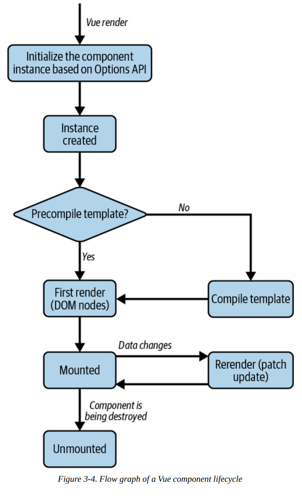

# Composición de componentes

En el capítulo anterior, aprendiste los fundamentos de Vue y cómo escribir un componente de Vue con directivas comunes usando la API de Opciones. Ahora estás listo para profundizar al siguiente nivel: componer componentes de Vue más complejos con reactividad y hooks.

Este capítulo presenta el estándar de Componente de Archivo Único (SFC) de Vue, los hooks del ciclo de vida del componente y otras características reactivas avanzadas como propiedades computadas, observadores (watchers), métodos y referencias (refs). También aprenderás a usar slots para renderizar dinámicamente diferentes partes del componente mientras mantienes la estructura del componente con estilos. Al final de este capítulo, podrás escribir componentes de Vue complejos en tu aplicación.

## Estructura del Componente de Archivo Único de Vue (SFC)

Vue introduce un nuevo formato de archivo estándar, el SFC de Vue (Componente de Archivo Único), identificado por la extensión `.vue`. Con el SFC, puedes escribir el código de la plantilla HTML, la lógica JavaScript y los estilos CSS para un componente en el mismo archivo, cada uno en su sección de código dedicada. Un SFC de Vue contiene tres secciones de código esenciales:

`Template`

: Este bloque de código HTML renderiza la vista de UI del componente. Solo debe aparecer una vez por componente, en el elemento de nivel más alto.

`Script`

: Este bloque de código JavaScript contiene la lógica principal del componente y solo aparece como máximo una vez por archivo de componente.

`Style`

: Este bloque de código CSS contiene los estilos para el componente. Es opcional y puede aparecer tantas veces como sea necesario por archivo de componente.

El ejemplo 3-1 muestra la estructura de un archivo SFC para un componente de Vue llamado **MyFirstComponent**.

```js linenums="1" title="Example 3-1. SFC structure of MyFirstComponent component"
<template>
  <h2 class="heading">I am a a Vue component</h2>
</template>

<script lang="ts">
  export default {
  name: 'MyFistComponent',
  };
</script>

<style>
  .heading {
    font-size: 16px;
  }
</style>
```

También podemos refactorizar el código de un componente que no sea SFC para convertirlo en SFC, como se muestra en la Figura 3-1.


Como muestra la figura 3‑1, realizamos la siguiente refactorización:

- Movemos el código HTML que aparece como valor de cadena en el campo `template` hacia la sección `<template>` del Single File Component.  

- Movemos el resto de la lógica de `MyFirstComponent` a la sección `<script>` del Single File Component, como parte del objeto `export default {}`.

!!! tip "CONSEJO PARA USAR TYPESCRIPT  "

    

    Deberías añadir el atributo `lang="ts"` de TypeScript a la sintaxis `<script>`, así:  

    ```html
    <script lang="ts">
    ```

    de modo que el motor de Vue sepa que debe manejar el código según el formato de TypeScript.

Dado que el formato de archivo `.vue` es una extensión estándar única, necesitas usar una herramienta de construcción especial (compilador/transpilador) tal como Webpack, Rollup, etc., para pre‑compilar los archivos correspondientes a JavaScript y CSS adecuados para ser servidos en el lado del navegador.  

Cuando creas un nuevo proyecto con Vite, Vite ya configura estas herramientas como parte del proceso de scaffolding. Entonces puedes importar el componente como un módulo ES y declararlo como componente interno para usarlo en otros archivos de componente.  

A continuación se muestra un ejemplo de cómo importar `MyFirstComponent`, ubicado en el directorio `components`, para usarlo en el componente `App.vue`:

!!! example 

    === "Options API → Sin `setup`"

        Todavía se usa `export default` en Vue, especialmente cuando trabajas con la sintaxis clásica de componentes (Options API).

        ```vue linenums="1"
        <script lang="ts">
            import MyFirstComponent from './components/MyFirstComponent.vue';
            export default {
            components: {
                MyFirstComponent,
              }
            }
        </script>
        ```
    === "Vue 3 → Con `<script setup>`"

        Actualmente en Vue 3 ahora mucha gente usa más `<script setup>`, porque es más limpio y evita escribir export default.

        ```vue linenums="1"
        <script setup lang="ts">
            import MyFirstComponent from './components/MyFirstComponent.vue';
        </script>
        ```

Como muestra el Ejemplo 3-2, puede utilizar el componente importado consultando
su nombre, ya sea por **CamelCase** o **Snake Case**, en la sección de plantillas:

```vue title="Example 3-2. How to use the imported component"
<template>
    <my-first-component />
    <MyFirstComponent />
</template>
```
Vue hace una conversión automática entre los dos formatos. Cuando registras el componente como `MyFirstComponent` (CamelCase), Vue internamente entiende que `<my-first-component/>` y `<MyFirstComponent/>` son la misma cosa.

Es una convención que Vue maneja por ti:

```
MyFirstComponent  →  my-first-component
    ↑                      ↑
  CamelCase            kebab-case
```

Toma cada letra mayúscula (excepto la primera), le pone un guión delante y la convierte a minúscula.

Ambas líneas en el template hacen exactamente lo mismo, es solo una cuestión de estilo. En la práctica la gente suele preferir `<MyFirstComponent/>` dentro de SFCs (Single File Components) porque visualmente distingue mejor un componente tuyo de una etiqueta HTML nativa como `<div>` o `<input>`.

Este código genera el contenido del componente MyFirstComponent dos veces, como
se muestra en la Figura 3-2.


!!! note 

    La **plantilla** de un componente en el ejemplo 3‑2 contiene dos elementos raíz. Esta capacidad de fragmentación solo está disponible a partir de Vue 3.x.

Hemos aprendido cómo crear y usar un componente Vue utilizando el formato SFC (Single File Component). Como habrás notado, definimos `lang="ts"` en la etiqueta `<script>` para indicar al motor de Vue que estamos usando TypeScript. De este modo, el motor de Vue aplica una validación de tipos más estricta a cualquier código o expresión que aparezca en las secciones `<script>` y `<template>` del componente.  

Sin embargo, para aprovechar al máximo los beneficios de TypeScript en Vue, necesitamos usar el método `defineComponent()` al definir un componente, lo cual aprenderemos en la siguiente sección.

## Uso de defineComponent() para compatibilidad con TypeScript

El método `defineComponent()` es una función contenedora que recibe un objeto de configuraciones y devuelve ese mismo objeto con inferencia de tipos, para definir un componente.

!!! note

    El método `defineComponent`() solo está disponible en Vue 3.x y versiones posteriores, y solo es relevante cuando se requiere TypeScript.

El siguiente ejemplo ilustra el uso de **defineComponent()** para definir un componente.

!!! example "Defining a component with defineComponent()"

    === "Options Api "
        Aqui declaramos y definimos manualmente el `defineComponent()`
        ```vue linenums="1"
        <template>
           <h2 class="heading">{{ message }}</h2>
        </template>
        <script lang="ts">
           import { defineComponent } from 'vue';
           export default defineComponent({
           name: 'MyMessageComponent',
           data() {
              return {
                message: 'Welcome to Vue 3!'
              }    
            }
        });
        </script>
        ```
    === "Composition API (`script setup`)"

        Aqui gracais al `script setup` se crea automaticamente/implicitamente el `defineComponent()`
        ```vue
        <script setup lang="ts">
          import { ref } from 'vue' //(1)!
          const message = ref('Welcome to Vue 3!')
        </script>

        <template>
          <h2 class="heading">
            {{ message }}
          </h2>
        </template>
        ```   

        1. `ref()` es una **función** de Vue.js que crea una referencia reactiva. Cuando el valor cambia, Vue actualiza automáticamente la interfaz. <br/><br/>
        **¿Qué retorna?** <br/> `ref()` retorna un **objeto** reactivo parecido a:
        ```js linenums="1"
        RefImpl {
          dep: ...,
          __v_isRef: true,
          __v_isShallow: false,
          _rawValue: 0,
          _value: 0,
          value: Getter/Setter
        }
        ```
        **Acceder al valor** <br/> En JavaScript o TypeScript:
        ```js linenums="1"
        message.value
        ```
        **Modificar el valor**
        ```vue linenums="1"
        message.value = 'Nuevo mensaje'
        ```
        **En el template** <br/>
        Vue desempaqueta automáticamente `.value`: 
        ```vue linenums="1"
        {{ message }}
        ```
        **¿Qué recibe?** <br/>
        ```sh 
        - strings 
        - numbers 
        - booleans
        - arrays  
        - objects 
        ```
        **Importación**
        ```js linenums="1"
        import { ref } from 'vue'
        ```
        **Uso principal**
        ```sh
        Se utiliza en:  
        - Composition API
        - <script setup>
        para crear estado reactivo.
        ```

Si usas Visual Studio Code como tu IDE y tienes instalada la extensión Volar, verás que el tipo de `message` es `string` al pasar el cursor sobre `message` en la sección `<template>`, como se muestra en la figura 3‑3.


Deberías usar `defineComponent()` para soporte de TypeScript solo en componentes complejos, por ejemplo, cuando necesitas acceder a las propiedades de un componente a través de la instancia `this`. En los demás casos, puedes usar el método estándar para definir un componente SFC.

!!! note

    En este libro verás una combinación del enfoque tradicional de definición de componentes y `defineComponent()`, según sea adecuado. Eres libre de decidir qué método funciona mejor para ti.

A continuación, exploraremos el ciclo de vida de un componente y sus enlaces.

## Hooks del ciclo de vida de los componentes

El ciclo de vida de un componente de Vue comienza cuando Vue crea una instancia del
componente y finaliza al destruir la instancia del componente (o desmontaje).

Vue divide el ciclo de vida del componente en fases (Figura 3-4).



`Fase de inicialización `
: El renderizador de Vue carga las configuraciones de opciones del componente y se prepara para la creación de la instancia del componente. [doc.vueframework](https://doc.vueframework.com/guide/instance.html)

`Fase de creación`  

: El renderizador de Vue crea la instancia del componente. Si la plantilla requiere compilación, habrá un paso adicional para compilarla antes de continuar con la siguiente fase. [oreateai](https://www.oreateai.com/blog/indepth-analysis-of-core-concepts-in-vuejs/aa3e2a5583da63e5dc24cafd36b327b5)

`Fase de primer renderizado ` 

: El renderizador de Vue crea e inserta los nodos del DOM correspondientes al componente en su árbol DOM. [vuejs](https://vuejs.org/guide/essentials/lifecycle)

`Fase de montaje  `
: Los elementos anidados del componente ya están montados y adjuntos al árbol DOM del componente, como se ve en la figura 3‑5. El renderizador de Vue luego conecta el componente a su contenedor padre. A partir de esta fase, tienes acceso a la propiedad `$el` del componente, que representa su nodo DOM.  

`Fase de actualización ` 

: Esta fase solo es relevante si cambian los datos reactivos del componente. En este punto, el renderizador de Vue vuelve a renderizar los nodos del DOM del componente con los nuevos datos y realiza una actualización tipo *patch*. De forma similar a la fase de montaje, el proceso de actualización termina primero con los elementos hijos y luego con el componente en sí.  

`Fase de desmontaje  `
: El renderizador de Vue desvincula el componente del DOM y destruye la instancia, así como todos los efectos de sus datos reactivos. Esta es la última fase del ciclo de vida, que ocurre cuando el componente ya no se usa en la aplicación. Al igual que en las fases de actualización y montaje, un componente solo puede desmontarse una vez que todos sus hijos ya han sido desmontados.


Vue permite que adjuntes algunos eventos a transiciones específicas entre estas fases del ciclo de vida, para tener mejor control sobre el flujo del componente. A estos eventos se les llama *ganchos de ciclo de vida* (*lifecycle hooks*). Los ganchos de ciclo de vida disponibles en Vue se describen en las siguientes secciones.

### setup
`setup` es el primer gancho de evento que se ejecuta antes de que comience el ciclo de vida del componente. Este gancho se ejecuta una vez, antes de que Vue instancie el componente. En esta fase aún no existe una instancia del componente, por lo tanto no se tiene acceso a `this`.

```js linenums="1"
export default {
 setup() {
   console.log('setup hook')
   console.log(this) // undefined
  }
}
```
!!! note

    Una alternativa al enlace de configuración es agregar el atributo de configuración a la sección de etiqueta de script del componente `(<script setup>`).

El gancho `setup` se usa principalmente con la Composition API (aprenderemos más en el capítulo 5). Su sintaxis es:

```js linenums="1"
setup(props, context) {
// ...
}
```
`setup()` recibe dos argumentos:

**props** — Un objeto que contiene todas las props pasadas al componente, declaradas usando el campo `props` del objeto de opciones del componente. Cada propiedad de `props` es dato reactivo. No necesitas retornar `props` como parte del objeto de retorno de `setup()`.

**context** — Un objeto no reactivo que contiene el contexto del componente, como `attrs`, `slots`, `emit` y `expose`.


!!! note 

    Si usas `<script setup>`, necesitas usar `defineProps()` para definir y acceder a estas props. Ver "Declarando Props usando `defineProps()` y `withDefaults()`".


`setup()` retorna un objeto que contiene todas las referencias al estado reactivo interno del componente, métodos y cualquier dato estático. Supón que usas `<script setup>`; no necesitas retornar nada. En ese caso, Vue traducirá automáticamente todas las variables y funciones declaradas dentro de esta sintaxis al objeto de retorno apropiado de `setup()` durante la compilación. Luego puedes acceder a ellas en el template u otras partes del objeto de opciones del componente usando la palabra clave `this`.

El Ejemplo 3-4 muestra el uso del hook `setup()` para definir un componente que imprime un mensaje estático.

```js linenums="1" title="Example 3-4. Defining a component with the setup() hook"
import { defineComponent } from 'vue';
export default defineComponent({
setup() {
  const message = 'Welcome to Vue 3!'
  return {
    message
    }
  }
})
```
Nota que aquí `message` no es dato reactivo. Para hacerlo reactivo, debes envolverlo con la función `ref()` de la Composition API. Aprenderemos más sobre esto en "Manejando Datos con `ref()` y `reactive()`". Además, ya no necesitamos definir `message` como parte del objeto `data()`, reduciendo la cantidad de datos reactivos no deseados en un componente.

Alternativamente, como muestra el ejemplo 3-5, puede escribir el componente anterior
utilizando la sintaxis `<script setup>`.

```vue linenums="1" title="Example 3-5. Defining a component with <script setup> syntax"
<script setup lang='ts'>
  onst message = 'Welcome to Vue 3!'
</script>
```
Una gran ventaja de usar `<script setup>` en lugar de `setup()` es que tiene soporte integrado para TypeScript. Como resultado, no hay necesidad de `defineComponent()`, y escribir componentes requiere menos código.

Al usar el hook `setup()`, también puedes combinarlo con la función de renderizado `h()` para retornar un renderer para el componente basado en los argumentos `props` y `context`, como muestra el Ejemplo 3-6.

```js linenums="1" title="Example 3-6. Defining a component with the setup() hook and h() render function"
import { defineComponent, h } from 'vue';
export default defineComponent({
setup(props, context) {
  const message = 'Welcome to Vue 3!'
  return () => h('div', message)
  }
})

```
Es útil usar setup() con h() cuando se desea crear un componente que renderice una estructura DOM estática diferente en función de las props que se le pasen o un componente funcional sin estado. (la Figura 3-6 muestra la salida de
Ejemplo 3-6 en la pestaña Vue de Chrome Devtools).


 en Vue Devtools')


!!! note

    A partir de ahora, utilizaremos la sintaxis `<script setup>` para demostrar casos de uso del hook setup() del componente debido a su simplicidad, siempre que sea aplicable.

### beforeCreate
beforeCreate se ejecuta antes de que el renderizador de Vue cree la instancia del componente. Aquí el motor de Vue ha inicializado el componente pero aún no ha ejecutado la función **data()** ni calculado ninguna propiedad computada(computed). Por lo tanto, no hay datos reactivos disponibles.

### created
Este hook se ejecuta después de que el motor de Vue crea la instancia del componente. En esta etapa, la instancia del componente existe con datos reactivos, *watchers*, propiedades computadas y métodos definidos. Sin embargo, el motor de Vue aún no la ha montado en el DOM.  

El hook `created` se ejecuta antes del primer renderizado del componente. Ayuda a realizar tareas que requieren que `this` esté disponible, como cargar datos desde un recurso externo dentro del componente.

### beforeMount
Este hook se ejecuta después de la creación. Aquí, el renderizador de Vue ha creado la instancia del componente y compilado su plantilla para renderizarla antes de la primera renderización del componente.

### mounted
Este hook se ejecuta después del primer renderizado del componente. En esta fase, el nodo DOM renderizado del componente está disponible para que lo accedas a través de la propiedad ++. Puedes usar este gancho para realizar cálculos adicionales con efectos secundarios sobre el nodo DOM del componente.

### beforeUpdate
El renderizador de Vue actualiza el árbol DOM del componente cuando cambia el estado de los datos locales. Este hook se ejecuta después de que comienza el proceso de actualización, y aún puedes usarlo para modificar el estado del componente internamente.

### updated
Este hook se ejecuta después de que el renderizador de Vue actualiza el árbol DOM del componente.

!!! note 

    Los hooks **updated**, **beforeUpdate**, **beforeMount** y **mounted** no están disponibles en la representación del lado del servidor (SSR).

Utilice este gancho con precaución, ya que se ejecuta después de cualquier actualización del DOM del componente.

!!! info "ACTUALIZAR ESTADO LOCAL DENTRO DEL GANCHO ACTUALIZADO"

    No debes modificar el estado de datos local del componente en este hook.

### beforeUnmount
Este hook se ejecuta antes de que el renderizador de Vue comience a desmontar el componente. En este punto, el nodo DOM del componente, **$el**, todavía está disponible.

### unmounted
Este hook se ejecuta después de que el proceso de desmontaje finaliza correctamente y la instancia del componente ya no está disponible. Este gancho puede limpiar observadores o efectos adicionales, como los detectores de eventos del DOM.


!!! note 

    En Vue 2.x, debes usar `beforeDestroy` y `destroyed` en lugar de `beforeUnmount` y `mounted`, respectivamente.

    Los hooks `beforeUnmounted` y `unmounted` no están disponibles en la renderización del lado del servidor (SSR).

En resumen, podemos redibujar el diagrama del ciclo de vida de nuestro componente con los hooks del ciclo de vida, como se muestra en la Figura 3-7.


Podemos experimentar con el orden de ejecución de cada gancho del ciclo de vida con el componente del Ejemplo 3-7.

```vue linenums="1" title="Example 3-7. Console log of lifecycle hooks"
<template>
  <h2 class="heading">I am {{message}}</h2>
  <input v-model="message" type="text" placeholder="Enter your name" />
</template>

<script lang="ts">
  import { defineComponent } from 'vue'
  export default defineComponent({
  name: 'MyFistComponent',
  data() {
    return {
      message: ''
    }
  },
  setup() {
    console.log('setup hook triggered!')
    return {}
  },
  beforeCreate() {
    console.log('beforeCreate hook triggered!')
  },
  created() {
    console.log('created hook triggered!')
  },
  beforeMount() {
    console.log('beforeMount hook triggered!')
  },
  mounted() {
    console.log('mounted hook triggered!')
  },
  beforeUpdate() {
    console.log('beforeUpdate hook triggered!')
  },
  updated() {
    console.log('updated hook triggered!')
  },
  beforeUnmount() {
    console.log('beforeUnmount hook triggered!')
  },
  });
</script>
```


Cuando cambiamos el valor de la propiedad del mensaje, el componente se vuelve a renderizar y la consola muestra la salida como se muestra en la Figura 3-9.


También podemos revisar este orden del ciclo de vida en la pestaña Cronología, sección Rendimiento, de Vue Devtools, como se muestra en la Figura 3-10 para el primer renderizado.


Y cuando el componente se vuelve a renderizar, la pestaña Herramientas para desarrolladores de Vue muestra los registros de eventos de la línea de tiempo, como en la Figura 3-11.


Cada uno de los hooks del ciclo de vida anteriores puede resultar beneficioso. En la Tabla 3-1 encontrará los casos de uso más comunes para cada gancho.

_Table 3-1. Using the right hook for the right purpose_

| Lifecycle Hook | Use case |
|---|---|
| `beforeCreate` | Cuando necesitas cargar lógica externa *sin* modificar los datos del componente. |
| `created` | Cuando necesitas cargar datos externos en el componente. Este hook es preferible al `mounted` para leer o escribir datos desde recursos externos. |
| `mounted` | Cuando necesitas realizar cualquier manipulación del DOM o acceder al nodo DOM del componente `this.$el`. |

Hasta ahora, hemos aprendido el orden del ciclo de vida del componente y sus hooks disponibles. A continuación, veremos cómo crear y organizar la lógica común del componente en métodos con la propiedad `method`.

## Methods
Los métodos son lógica que no depende de los datos del componente, aunque podemos acceder al estado local del componente usando la instancia `this` dentro de un método. Los métodos del componente son funciones definidas dentro de la propiedad `methods`. Como muestra el Ejemplo 3‑8, podemos definir un método para invertir la propiedad `message`.

