# Composición de componentes

En el capítulo anterior, aprendiste los fundamentos de Vue y cómo escribir un componente de Vue con directivas comunes usando la API de Opciones. Ahora estás listo para profundizar al siguiente nivel: componer componentes de Vue más complejos con reactividad y hooks.

Este capítulo presenta el estándar de Componente de Archivo Único (SFC) de Vue, los hooks del ciclo de vida del componente y otras características reactivas avanzadas como propiedades computadas, observadores (watchers), métodos y referencias (refs). También aprenderás a usar slots para renderizar dinámicamente diferentes partes del componente mientras mantienes la estructura del componente con estilos. Al final de este capítulo, podrás escribir componentes de Vue complejos en tu aplicación.

---

## Estructura del Componente de Archivo Único de Vue (SFC)

Vue introduce un nuevo formato de archivo estándar, el SFC de Vue (Componente de Archivo Único), identificado por la extensión `.vue`. Con el SFC, puedes escribir el código de la plantilla HTML, la lógica JavaScript y los estilos CSS para un componente en el mismo archivo, cada uno en su sección de código dedicada. Un SFC de Vue contiene tres secciones de código esenciales:

`Template`

: Este bloque de código HTML renderiza la vista de UI del componente. Solo debe aparecer una vez por componente, en el elemento de nivel más alto.

`Script`

: Este bloque de código JavaScript contiene la lógica principal del componente y solo aparece como máximo una vez por archivo de componente.

`Style`

: Este bloque de código CSS contiene los estilos para el componente. Es opcional y puede aparecer tantas veces como sea necesario por archivo de componente.

El ejemplo 3-1 muestra la estructura de un archivo SFC para un componente de Vue llamado **MyFirstComponent**.

```js linenums="1" title="Example 3-1. SFC structure of MyFirstComponent component"
<template>
  <h2 class="heading">I am a a Vue component</h2>
</template>

<script lang="ts">
  export default {
  name: 'MyFistComponent',
  };
</script>

<style>
  .heading {
    font-size: 16px;
  }
</style>
```

También podemos refactorizar el código de un componente que no sea SFC para convertirlo en SFC, como se muestra en la Figura 3-1.


Como muestra la figura 3‑1, realizamos la siguiente refactorización:

- Movemos el código HTML que aparece como valor de cadena en el campo `template` hacia la sección `<template>` del Single File Component.  

- Movemos el resto de la lógica de `MyFirstComponent` a la sección `<script>` del Single File Component, como parte del objeto `export default {}`.

!!! tip "CONSEJO PARA USAR TYPESCRIPT  "

    

    Deberías añadir el atributo `lang="ts"` de TypeScript a la sintaxis `<script>`, así:  

    ```html
    <script lang="ts">
    ```

    de modo que el motor de Vue sepa que debe manejar el código según el formato de TypeScript.

Dado que el formato de archivo `.vue` es una extensión estándar única, necesitas usar una herramienta de construcción especial (compilador/transpilador) tal como Webpack, Rollup, etc., para pre‑compilar los archivos correspondientes a JavaScript y CSS adecuados para ser servidos en el lado del navegador.  

Cuando creas un nuevo proyecto con Vite, Vite ya configura estas herramientas como parte del proceso de scaffolding. Entonces puedes importar el componente como un módulo ES y declararlo como componente interno para usarlo en otros archivos de componente.  

A continuación se muestra un ejemplo de cómo importar `MyFirstComponent`, ubicado en el directorio `components`, para usarlo en el componente `App.vue`:

!!! example 

    === "Options API → Sin `setup`"

        Todavía se usa `export default` en Vue, especialmente cuando trabajas con la sintaxis clásica de componentes (Options API).

        ```vue linenums="1"
        <script lang="ts">
            import MyFirstComponent from './components/MyFirstComponent.vue';
            export default {
            components: {
                MyFirstComponent,
              }
            }
        </script>
        ```
    === "Vue 3 → Con `<script setup>`"

        Actualmente en Vue 3 ahora mucha gente usa más `<script setup>`, porque es más limpio y evita escribir export default.

        ```vue linenums="1"
        <script setup lang="ts">
            import MyFirstComponent from './components/MyFirstComponent.vue';
        </script>
        ```

Como muestra el Ejemplo 3-2, puede utilizar el componente importado consultando
su nombre, ya sea por **CamelCase** o **Snake Case**, en la sección de plantillas:

```vue title="Example 3-2. How to use the imported component"
<template>
    <my-first-component />
    <MyFirstComponent />
</template>
```
Vue hace una conversión automática entre los dos formatos. Cuando registras el componente como `MyFirstComponent` (CamelCase), Vue internamente entiende que `<my-first-component/>` y `<MyFirstComponent/>` son la misma cosa.

Es una convención que Vue maneja por ti:

```
MyFirstComponent  →  my-first-component
    ↑                      ↑
  CamelCase            kebab-case
```

Toma cada letra mayúscula (excepto la primera), le pone un guión delante y la convierte a minúscula.

Ambas líneas en el template hacen exactamente lo mismo, es solo una cuestión de estilo. En la práctica la gente suele preferir `<MyFirstComponent/>` dentro de SFCs (Single File Components) porque visualmente distingue mejor un componente tuyo de una etiqueta HTML nativa como `<div>` o `<input>`.

Este código genera el contenido del componente MyFirstComponent dos veces, como
se muestra en la Figura 3-2.


!!! note 

    La **plantilla** de un componente en el ejemplo 3‑2 contiene dos elementos raíz. Esta capacidad de fragmentación solo está disponible a partir de Vue 3.x.

Hemos aprendido cómo crear y usar un componente Vue utilizando el formato SFC (Single File Component). Como habrás notado, definimos `lang="ts"` en la etiqueta `<script>` para indicar al motor de Vue que estamos usando TypeScript. De este modo, el motor de Vue aplica una validación de tipos más estricta a cualquier código o expresión que aparezca en las secciones `<script>` y `<template>` del componente.  

Sin embargo, para aprovechar al máximo los beneficios de TypeScript en Vue, necesitamos usar el método `defineComponent()` al definir un componente, lo cual aprenderemos en la siguiente sección.

---

## Uso de defineComponent() para compatibilidad con TypeScript

El método `defineComponent()` es una función contenedora que recibe un objeto de configuraciones y devuelve ese mismo objeto con inferencia de tipos, para definir un componente.

!!! note

    El método `defineComponent`() solo está disponible en Vue 3.x y versiones posteriores, y solo es relevante cuando se requiere TypeScript.

El siguiente ejemplo ilustra el uso de **defineComponent()** para definir un componente.

!!! example "Defining a component with defineComponent()"

    === "Options Api "
        Aqui declaramos y definimos manualmente el `defineComponent()`
        ```vue linenums="1"
        <template>
           <h2 class="heading">{{ message }}</h2>
        </template>
        <script lang="ts">
           import { defineComponent } from 'vue';
           export default defineComponent({
           name: 'MyMessageComponent',
           data() {
              return {
                message: 'Welcome to Vue 3!'
              }    
            }
        });
        </script>
        ```
    === "Composition API (`script setup`)"

        Aqui gracais al `script setup` se crea automaticamente/implicitamente el `defineComponent()`
        ```vue
        <script setup lang="ts">
          import { ref } from 'vue' //(1)!
          const message = ref('Welcome to Vue 3!')
        </script>

        <template>
          <h2 class="heading">
            {{ message }}
          </h2>
        </template>
        ```   

        1. `ref()` es una **función** de Vue.js que crea una referencia reactiva. Cuando el valor cambia, Vue actualiza automáticamente la interfaz. <br/><br/>
        **¿Qué retorna?** <br/> `ref()` retorna un **objeto** reactivo parecido a:
        ```js linenums="1"
        RefImpl {
          dep: ...,
          __v_isRef: true,
          __v_isShallow: false,
          _rawValue: 0,
          _value: 0,
          value: Getter/Setter
        }
        ```
        **Acceder al valor** <br/> En JavaScript o TypeScript:
        ```js linenums="1"
        message.value
        ```
        **Modificar el valor**
        ```vue linenums="1"
        message.value = 'Nuevo mensaje'
        ```
        **En el template** <br/>
        Vue desempaqueta automáticamente `.value`: 
        ```vue linenums="1"
        {{ message }}
        ```
        **¿Qué recibe?** <br/>
        ```sh 
        - strings 
        - numbers 
        - booleans
        - arrays  
        - objects 
        ```
        **Importación**
        ```js linenums="1"
        import { ref } from 'vue'
        ```
        **Uso principal**
        ```sh
        Se utiliza en:  
        - Composition API
        - <script setup>
        para crear estado reactivo.
        ```

Si usas Visual Studio Code como tu IDE y tienes instalada la extensión Volar, verás que el tipo de `message` es `string` al pasar el cursor sobre `message` en la sección `<template>`, como se muestra en la figura 3‑3.


Deberías usar `defineComponent()` para soporte de TypeScript solo en componentes complejos, por ejemplo, cuando necesitas acceder a las propiedades de un componente a través de la instancia `this`. En los demás casos, puedes usar el método estándar para definir un componente SFC.

!!! note

    En este libro verás una combinación del enfoque tradicional de definición de componentes y `defineComponent()`, según sea adecuado. Eres libre de decidir qué método funciona mejor para ti.

A continuación, exploraremos el ciclo de vida de un componente y sus enlaces.

---

## Hooks del ciclo de vida de los componentes

El ciclo de vida de un componente de Vue comienza cuando Vue crea una instancia del
componente y finaliza al destruir la instancia del componente (o desmontaje).

Vue divide el ciclo de vida del componente en fases (Figura 3-4).


`Fase de inicialización `
: El renderizador de Vue carga las configuraciones de opciones del componente y se prepara para la creación de la instancia del componente. [doc.vueframework](https://doc.vueframework.com/guide/instance.html)

`Fase de creación`  

: El renderizador de Vue crea la instancia del componente. Si la plantilla requiere compilación, habrá un paso adicional para compilarla antes de continuar con la siguiente fase. [oreateai](https://www.oreateai.com/blog/indepth-analysis-of-core-concepts-in-vuejs/aa3e2a5583da63e5dc24cafd36b327b5)

`Fase de primer renderizado ` 

: El renderizador de Vue crea e inserta los nodos del DOM correspondientes al componente en su árbol DOM. [vuejs](https://vuejs.org/guide/essentials/lifecycle)

`Fase de montaje  `
: Los elementos anidados del componente ya están montados y adjuntos al árbol DOM del componente, como se ve en la figura 3‑5. El renderizador de Vue luego conecta el componente a su contenedor padre. A partir de esta fase, tienes acceso a la propiedad `$el` del componente, que representa su nodo DOM.  

`Fase de actualización ` 

: Esta fase solo es relevante si cambian los datos reactivos del componente. En este punto, el renderizador de Vue vuelve a renderizar los nodos del DOM del componente con los nuevos datos y realiza una actualización tipo *patch*. De forma similar a la fase de montaje, el proceso de actualización termina primero con los elementos hijos y luego con el componente en sí.  

`Fase de desmontaje  `
: El renderizador de Vue desvincula el componente del DOM y destruye la instancia, así como todos los efectos de sus datos reactivos. Esta es la última fase del ciclo de vida, que ocurre cuando el componente ya no se usa en la aplicación. Al igual que en las fases de actualización y montaje, un componente solo puede desmontarse una vez que todos sus hijos ya han sido desmontados.


Vue permite que adjuntes algunos eventos a transiciones específicas entre estas fases del ciclo de vida, para tener mejor control sobre el flujo del componente. A estos eventos se les llama *ganchos de ciclo de vida* (*lifecycle hooks*). Los ganchos de ciclo de vida disponibles en Vue se describen en las siguientes secciones.

### setup
`setup` es el primer gancho de evento que se ejecuta antes de que comience el ciclo de vida del componente. Este gancho se ejecuta una vez, antes de que Vue instancie el componente. En esta fase aún no existe una instancia del componente, por lo tanto no se tiene acceso a `this`.

```js linenums="1"
export default {
 setup() {
   console.log('setup hook')
   console.log(this) // undefined
  }
}
```
!!! note

    Una alternativa al enlace de configuración es agregar el atributo de configuración a la sección de etiqueta de script del componente `(<script setup>`).

El gancho `setup` se usa principalmente con la Composition API (aprenderemos más en el capítulo 5). Su sintaxis es:

```js linenums="1"
setup(props, context) {
// ...
}
```
`setup()` recibe dos argumentos:

**props** — Un objeto que contiene todas las props pasadas al componente, declaradas usando el campo `props` del objeto de opciones del componente. Cada propiedad de `props` es dato reactivo. No necesitas retornar `props` como parte del objeto de retorno de `setup()`.

**context** — Un objeto no reactivo que contiene el contexto del componente, como `attrs`, `slots`, `emit` y `expose`.


!!! note 

    Si usas `<script setup>`, necesitas usar `defineProps()` para definir y acceder a estas props. Ver "Declarando Props usando `defineProps()` y `withDefaults()`".


`setup()` retorna un objeto que contiene todas las referencias al estado reactivo interno del componente, métodos y cualquier dato estático. Supón que usas `<script setup>`; no necesitas retornar nada. En ese caso, Vue traducirá automáticamente todas las variables y funciones declaradas dentro de esta sintaxis al objeto de retorno apropiado de `setup()` durante la compilación. Luego puedes acceder a ellas en el template u otras partes del objeto de opciones del componente usando la palabra clave `this`.

El Ejemplo 3-4 muestra el uso del hook `setup()` para definir un componente que imprime un mensaje estático.

```js linenums="1" title="Example 3-4. Defining a component with the setup() hook"
import { defineComponent } from 'vue';
export default defineComponent({
setup() {
  const message = 'Welcome to Vue 3!'
  return {
    message
    }
  }
})
```
Nota que aquí `message` no es dato reactivo. Para hacerlo reactivo, debes envolverlo con la función `ref()` de la Composition API. Aprenderemos más sobre esto en "Manejando Datos con `ref()` y `reactive()`". Además, ya no necesitamos definir `message` como parte del objeto `data()`, reduciendo la cantidad de datos reactivos no deseados en un componente.

Alternativamente, como muestra el ejemplo 3-5, puede escribir el componente anterior
utilizando la sintaxis `<script setup>`.

```vue linenums="1" title="Example 3-5. Defining a component with <script setup> syntax"
<script setup lang='ts'>
  onst message = 'Welcome to Vue 3!'
</script>
```
Una gran ventaja de usar `<script setup>` en lugar de `setup()` es que tiene soporte integrado para TypeScript. Como resultado, no hay necesidad de `defineComponent()`, y escribir componentes requiere menos código.

Al usar el hook `setup()`, también puedes combinarlo con la función de renderizado `h()` para retornar un renderer para el componente basado en los argumentos `props` y `context`, como muestra el Ejemplo 3-6.

```js linenums="1" title="Example 3-6. Defining a component with the setup() hook and h() render function"
import { defineComponent, h } from 'vue';
export default defineComponent({
setup(props, context) {
  const message = 'Welcome to Vue 3!'
  return () => h('div', message)
  }
})

```
Es útil usar setup() con h() cuando se desea crear un componente que renderice una estructura DOM estática diferente en función de las props que se le pasen o un componente funcional sin estado. (la Figura 3-6 muestra la salida de
Ejemplo 3-6 en la pestaña Vue de Chrome Devtools).


 en Vue Devtools')


!!! note

    A partir de ahora, utilizaremos la sintaxis `<script setup>` para demostrar casos de uso del hook setup() del componente debido a su simplicidad, siempre que sea aplicable.

### beforeCreate
beforeCreate se ejecuta antes de que el renderizador de Vue cree la instancia del componente. Aquí el motor de Vue ha inicializado el componente pero aún no ha ejecutado la función **data()** ni calculado ninguna propiedad computada(computed). Por lo tanto, no hay datos reactivos disponibles.

### created
Este hook se ejecuta después de que el motor de Vue crea la instancia del componente. En esta etapa, la instancia del componente existe con datos reactivos, *watchers*, propiedades computadas y métodos definidos. Sin embargo, el motor de Vue aún no la ha montado en el DOM.  

El hook `created` se ejecuta antes del primer renderizado del componente. Ayuda a realizar tareas que requieren que `this` esté disponible, como cargar datos desde un recurso externo dentro del componente.

### beforeMount
Este hook se ejecuta después de la creación. Aquí, el renderizador de Vue ha creado la instancia del componente y compilado su plantilla para renderizarla antes de la primera renderización del componente.

### mounted
Este hook se ejecuta después del primer renderizado del componente. En esta fase, el nodo DOM renderizado del componente está disponible para que lo accedas a través de la propiedad ++. Puedes usar este gancho para realizar cálculos adicionales con efectos secundarios sobre el nodo DOM del componente.

### beforeUpdate
El renderizador de Vue actualiza el árbol DOM del componente cuando cambia el estado de los datos locales. Este hook se ejecuta después de que comienza el proceso de actualización, y aún puedes usarlo para modificar el estado del componente internamente.

### updated
Este hook se ejecuta después de que el renderizador de Vue actualiza el árbol DOM del componente.

!!! note 

    Los hooks **updated**, **beforeUpdate**, **beforeMount** y **mounted** no están disponibles en la representación del lado del servidor (SSR).

Utilice este gancho con precaución, ya que se ejecuta después de cualquier actualización del DOM del componente.

!!! info "ACTUALIZAR ESTADO LOCAL DENTRO DEL GANCHO ACTUALIZADO"

    No debes modificar el estado de datos local del componente en este hook.

### beforeUnmount
Este hook se ejecuta antes de que el renderizador de Vue comience a desmontar el componente. En este punto, el nodo DOM del componente, **$el**, todavía está disponible.

### unmounted
Este hook se ejecuta después de que el proceso de desmontaje finaliza correctamente y la instancia del componente ya no está disponible. Este gancho puede limpiar observadores o efectos adicionales, como los detectores de eventos del DOM.


!!! note 

    En Vue 2.x, debes usar `beforeDestroy` y `destroyed` en lugar de `beforeUnmount` y `mounted`, respectivamente.

    Los hooks `beforeUnmounted` y `unmounted` no están disponibles en la renderización del lado del servidor (SSR).

En resumen, podemos redibujar el diagrama del ciclo de vida de nuestro componente con los hooks del ciclo de vida, como se muestra en la Figura 3-7.


Podemos experimentar con el orden de ejecución de cada gancho del ciclo de vida con el componente del Ejemplo 3-7.

```vue linenums="1" title="Example 3-7. Console log of lifecycle hooks"
<template>
  <h2 class="heading">I am {{message}}</h2>
  <input v-model="message" type="text" placeholder="Enter your name" />
</template>

<script lang="ts">
  import { defineComponent } from 'vue'
  export default defineComponent({
  name: 'MyFistComponent',
  data() {
    return {
      message: ''
    }
  },
  setup() {
    console.log('setup hook triggered!')
    return {}
  },
  beforeCreate() {
    console.log('beforeCreate hook triggered!')
  },
  created() {
    console.log('created hook triggered!')
  },
  beforeMount() {
    console.log('beforeMount hook triggered!')
  },
  mounted() {
    console.log('mounted hook triggered!')
  },
  beforeUpdate() {
    console.log('beforeUpdate hook triggered!')
  },
  updated() {
    console.log('updated hook triggered!')
  },
  beforeUnmount() {
    console.log('beforeUnmount hook triggered!')
  },
  });
</script>
```


Cuando cambiamos el valor de la propiedad del mensaje, el componente se vuelve a renderizar y la consola muestra la salida como se muestra en la Figura 3-9.


También podemos revisar este orden del ciclo de vida en la pestaña Cronología, sección Rendimiento, de Vue Devtools, como se muestra en la Figura 3-10 para el primer renderizado.


Y cuando el componente se vuelve a renderizar, la pestaña Herramientas para desarrolladores de Vue muestra los registros de eventos de la línea de tiempo, como en la Figura 3-11.


Cada uno de los hooks del ciclo de vida anteriores puede resultar beneficioso. En la Tabla 3-1 encontrará los casos de uso más comunes para cada gancho.

_Table 3-1. Using the right hook for the right purpose_

| Lifecycle Hook | Use case |
|---|---|
| `beforeCreate` | Cuando necesitas cargar lógica externa *sin* modificar los datos del componente. |
| `created` | Cuando necesitas cargar datos externos en el componente. Este hook es preferible al `mounted` para leer o escribir datos desde recursos externos. |
| `mounted` | Cuando necesitas realizar cualquier manipulación del DOM o acceder al nodo DOM del componente `this.$el`. |

Hasta ahora, hemos aprendido el orden del ciclo de vida del componente y sus hooks disponibles. A continuación, veremos cómo crear y organizar la lógica común del componente en métodos con la propiedad `method`.

---

## Methods
Los métodos son lógica que no depende de los datos del componente, aunque podemos acceder al estado local del componente usando la instancia `this` dentro de un método. Los métodos del componente son funciones definidas dentro de la propiedad `methods`. Como muestra el Ejemplo 3‑8, podemos definir un método para invertir la propiedad `message`.

```vue linenums="1" title="Example 3-8. Definiendo un método para invertir la propiedad message"
<script lang="ts">
import { defineComponent } from 'vue'
export default defineComponent({
  name: 'ReversedMessage',
  data() {
    return {
      message: '',
    };
  },
  methods: {
    reverseMessage(): string {
      return this.message.split('').reverse().join('')
    },
  },
});
</script>
```

El Ejemplo 3-9 muestra cómo podemos usar el método `reverseMessage` en la plantilla del componente.

```vue linenums="1" title="Example 3-9. Mostrando el mensaje invertido en la plantilla"
<template>
  <h2 class="heading">I am {{reverseMessage()}}</h2>
  <input v-model="message" type="text" placeholder="Enter your message" />
</template>
```

Cuando un usuario ingresa un valor de mensaje en el navegador, vemos la salida en la Figura 3-12. 

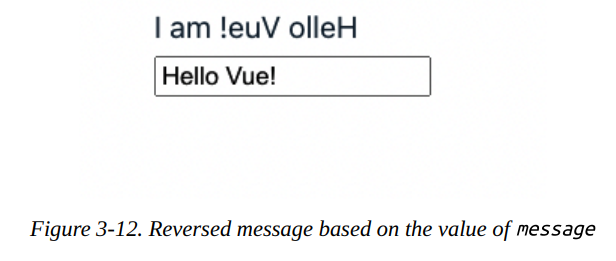

También puedes modificar el método `reverseMessage` para que acepte un argumento de tipo string, haciéndolo más reutilizable y menos dependiente de `this.message`, como en el Ejemplo 3-10.

```vue linenums="1" title="Example 3-10. Definiendo un método para invertir un string"
<script lang="ts">
import { defineComponent } from 'vue'
export default defineComponent({
  name: 'MyFistComponent',
  data() {
    return {
      message: '',
    };
  },
  methods: {
    reverseMessage(message: string): string {
      return message.split('').reverse().join('')
    },
  },
});
</script>
```

Y en la sección de la `template`, refactorizamos el Ejemplo 3-9 y pasamos `message` como parámetro de entrada para el método `reverseMessage`:

```vue linenums="1" title="Example 3-10 (cont.). Usando el método con parámetro en la plantilla"
<template>
  <h2 class="heading">I am {{reverseMessage(message)}}</h2>
  <input v-model="message" type="text" placeholder="Enter your message" />
</template>
```

La salida sigue siendo la misma que en la Figura 3-12.

También podemos ejecutar un método del componente desde otras propiedades o hooks del ciclo de vida usando la instancia `this`. Por ejemplo, podemos dividir `reverseMessage` en dos métodos más pequeños, `reverse()` y `arrToString()`, como en el siguiente código:

```js linenums="1" title="Dividiendo reverseMessage en métodos más pequeños"
/**... */
methods: {
  reverse(message: string): string[] {
    return message.split('').reverse()
  },
  arrToString(arr: string[]): string {
    return arr.join('')
  },
  reverseMessage(message: string): string {
    return this.arrToString(this.reverse(message))
  },
},
```

Los métodos son útiles para mantener la lógica del componente organizada. Vue ejecuta un método solo cuando es relevante (como cuando se llama en la plantilla del Ejemplo 3-9), permitiéndonos calcular dinámicamente un nuevo valor a partir de datos locales. Sin embargo, Vue no almacena en caché el resultado de cada ejecución del método, y siempre lo volverá a ejecutar cuando ocurra un rerenderizado. Por lo tanto, en escenarios donde necesites calcular nuevos datos, es mejor usar propiedades computadas, que exploraremos a continuación.

---

## Propiedades Computadas

Las propiedades computadas son una característica única de Vue que te permite calcular nuevas propiedades de datos reactivos a partir de cualquier dato reactivo de un componente. Cada propiedad computada es una función que retorna un valor y reside dentro del campo `computed`.

El Ejemplo 3-11 muestra cómo definimos una nueva propiedad computada, `reversedMessage`, que retorna el dato local `message` del componente en orden inverso.

```vue linenums="1" title="Example 3-11. Propiedad computada que retorna el mensaje local en orden inverso"
<script lang="ts">
import { defineComponent } from 'vue'
export default defineComponent({
  name: 'ReversedMessage',
  data() {
    return {
      message: 'Hello Vue!'
    }
  },
  computed: {
    reversedMessage() {
      return this.message.split('').reverse().join('')
    }
  }
})
</script>
```

Puedes acceder a `reversedMessage` computada de la misma forma que a cualquier dato local del componente. El Ejemplo 3-12 muestra cómo podemos mostrar el mensaje invertido calculado en base al valor de entrada de `message`.

```vue linenums="1" title="Example 3-12. Ejemplo de propiedad computada"
<template>
  <h2 class="heading">I am {{ reversedMessage }}</h2>
  <input v-model="message" type="text" placeholder="Enter your message" />
</template>
```

El Ejemplo 3-12 tiene la misma salida que la Figura 3-12.

También puedes rastrear la propiedad computada en la pestaña Components de Vue Devtools (Figura 3-13).

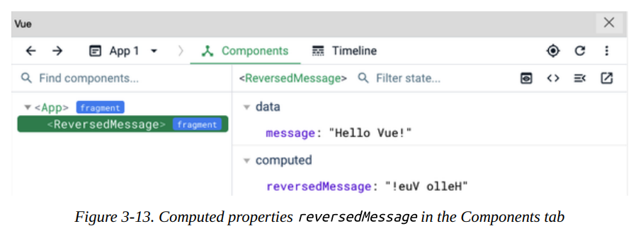

Del mismo modo, puedes acceder al valor de una propiedad computada en la lógica del componente a través de la instancia `this` como si fuera una propiedad de datos local. También puedes calcular una nueva propiedad computada basándote en el valor de otra propiedad computada. Como muestra el Ejemplo 3-13, podemos agregar la longitud del valor de `reversedMessage` a una nueva propiedad, `reversedMessageLength`.

```vue linenums="1" title="Example 3-13. Agregando la propiedad computada reversedMessageLength"
<script lang="ts">
import { defineComponent } from 'vue'
export default defineComponent({
  /**... */
  computed: {
    reversedMessage() {
      return this.message.split('').reverse().join('')
    },
    reversedMessageLength() {
      return this.reversedMessage.length
    }
  }
})
</script>
```

El motor de Vue automáticamente almacena en caché el valor de las propiedades computadas y recalcula el valor solo cuando los datos reactivos relacionados cambian. Como en el Ejemplo 3-12, Vue actualizará el valor de la propiedad computada `reversedMessage` solo cuando `message` cambie. Si quieres mostrar o reutilizar el valor de `reversedMessage` en otra ubicación dentro del componente, Vue no necesitará recalcular su valor.

Usar propiedades computadas ayuda a organizar modificaciones complejas de datos en bloques reutilizables. Esto reduce la cantidad de código requerido y mantiene el código limpio mientras mejora el rendimiento del componente. Usar propiedades computadas también te permite configurar rápidamente un observador automático para cualquier propiedad de datos reactiva, al hacer que aparezcan en la lógica de implementación de la función de propiedad computada.

Sin embargo, en algunos escenarios, este mecanismo de observación automática puede generar sobrecarga para mantener estable el rendimiento del componente. En tales casos, podemos considerar usar observadores (watchers) a través del campo `watch` del componente.

## Watchers (Observadores)

Los watchers te permiten observar programáticamente los cambios en cualquier propiedad de datos reactiva de un componente y manejarlos. Cada watcher es una función que recibe dos argumentos: el nuevo valor (`newValue`) y el valor actual (`oldValue`) del dato observado. Luego ejecuta cualquier lógica basada en estos dos parámetros de entrada. Definimos un watcher para datos reactivos agregándolo al campo `watch` de las opciones del componente, siguiendo esta sintaxis:

```js linenums="1" title="Sintaxis de un watcher"
watch: {
  'reactiveDataPropertyName'(newValue, oldValue) {
    // hacer algo
  }
}
```

Debes reemplazar `reactiveDataPropertyName` con el nombre del dato del componente que queremos observar.

El Ejemplo 3-14 muestra cómo definimos un nuevo watcher para observar cambios en el dato local `message` del componente.

```vue linenums="1" title="Example 3-14. Watcher que observa cambios en el mensaje local"
<script lang="ts">
import { defineComponent } from 'vue'
export default defineComponent({
  name: 'MyFirstComponent',
  data() {
    return {
      message: 'Hello Vue!'
    }
  },
  watch: {
    message(newValue: string, oldValue: string) {
      console.log(`new value: ${newValue}, old value: ${oldValue}`)
    }
  }
})
</script>
```

En este ejemplo, hemos definido un watcher `message` que observa cambios en la propiedad `message`. El motor de Vue ejecuta el watcher cada vez que el valor de `message` cambia. La Figura 3-14 muestra la salida en consola de este watcher.

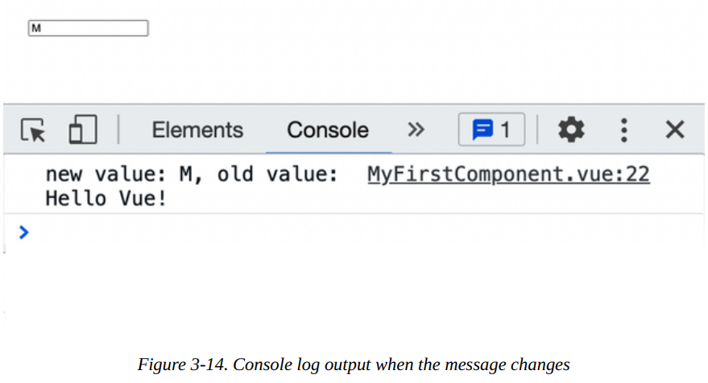

Podemos implementar `reversedMessage` del Ejemplo 3-11 usando un watcher en `message` y un campo `data()` en lugar de propiedades computadas, como se ve en el Ejemplo 3-15.

```vue linenums="1" title="Example 3-15. Watcher que actualiza reversedMessage al cambiar message"
<script lang="ts">
import { defineComponent } from 'vue'
export default defineComponent({
  name: 'MyFirstComponent',
  data() {
    return {
      message: 'Hello Vue!',
      reversedMessage: 'Hello Vue!'.split('').reverse().join('')
    }
  },
  watch: {
    message(newValue: string, oldValue: string) {
      this.reversedMessage = newValue.split('').reverse().join('')
    }
  }
})
</script>
```

La salida sigue siendo la misma que en la Figura 3-12. Sin embargo, este enfoque no se recomienda en este caso específico, ya que es menos eficiente que usar propiedades computadas.

!!! note

    Los **efectos secundarios (side effects)** son cualquier lógica adicional activada por el watcher o dentro de la propiedad computada. Los efectos secundarios pueden impactar el rendimiento del componente; debes manejarlos con precaución.

Puedes asignar la función manejadora directamente al nombre del watcher. El motor de Vue llamará automáticamente al manejador con un conjunto de configuraciones predeterminadas para los watchers. Sin embargo, también puedes pasar un objeto al nombre del watcher para personalizar su comportamiento, usando los campos de la 

#### Tabla 3-2.

| Campo del Watcher | Descripción | Tipo Aceptado | Valor por defecto | ¿Requerido? |
|---|---|---|---|---|
| `handler` | La función callback que se ejecuta cuando el valor del dato objetivo cambia. | `function` | N/A | Sí |
| `deep` | Indica si Vue debe observar cambios en las propiedades anidadas del dato objetivo (si las hay). | `boolean` | `false` | No |
| `immediate` | Indica si se debe ejecutar el handler inmediatamente después de montar el componente. | `boolean` | `false` | No |
| `flush` | Indica el orden de ejecución del handler. Por defecto, Vue ejecuta el handler antes de actualizar el componente. | `'pre'`, `'post'` | `'pre'` | No |

#### Observando cambios en propiedades anidadas

El campo `deep` te permite observar cambios en todas las propiedades anidadas. Tomemos como ejemplo un objeto `user` en un componente `UserWatcherComponent` con dos propiedades anidadas: `name` y `age`. Definimos un watcher `user` que observe cambios en las propiedades anidadas del objeto `user` usando el campo `deep`, como en el Ejemplo 3-16.

```vue linenums="1" title="Example 3-16. Watcher que observa cambios en propiedades anidadas del objeto user"
<script lang="ts">
import { defineComponent } from 'vue'

type User = {
  name: string
  age: number
}

export default defineComponent({
  name: 'UserWatcherComponent',
  data(): { user: User } {
    return {
      user: {
        name: 'John',
        age: 30
      }
    }
  },
  watch: {
    user: {
      handler(newValue: User, oldValue: User) {
        console.log({ newValue, oldValue })
      },
      deep: true
    }
  }
})
</script>
```

Como muestra el Ejemplo 3-17, en la sección de plantilla del componente `UserWatcherComponent`, recibimos la entrada para los campos del objeto `user`: `name` y `age`.

```vue linenums="1" title="Example 3-17. Sección de plantilla para UserWatcherComponent"
<template>
  <div>
    <div>
      <label for="name">Name:
        <input v-model="user.name" placeholder="Enter your name" id="name" />
      </label>
    </div>
    <div>
      <label for="age">Age:
        <input v-model="user.age" placeholder="Enter your age" id="age" />
      </label>
    </div>
  </div>
</template>
```

En este caso, el motor de Vue ejecuta el watcher `user` cada vez que el valor de `user.name` o `user.age` cambia. La Figura 3-15 muestra la salida en consola de este watcher cuando cambiamos el valor de `user.name`.

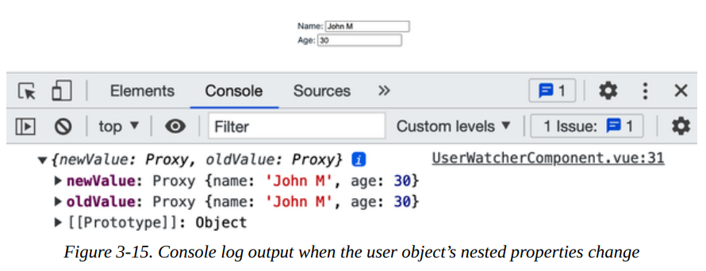

La Figura 3-15 muestra que el valor nuevo y antiguo de `user` son idénticos. Esto ocurre porque el objeto `user` sigue siendo la misma instancia y solo cambió el valor de su campo `name`.

Además, una vez que activamos la bandera `deep`, el motor de Vue recorrerá todas las propiedades del objeto `user` y sus propiedades anidadas, y luego observará los cambios en ellas. Por lo tanto, puede causar problemas de rendimiento cuando la estructura del objeto `user` contiene una estructura de datos interna más compleja. En este caso, es mejor especificar qué propiedades anidadas deseas monitorear, como se muestra en el Ejemplo 3-18.

```vue linenums="1" title="Example 3-18. Watcher que observa cambios en el nombre del usuario"
//...
export default defineComponent({
  //...
  watch: {
    'user.name': {
      handler(newValue: string, oldValue: string) {
        console.log({ newValue, oldValue })
      },
    },
  }
});
```

Aquí observamos cambios solo en la propiedad `user.name`. La Figura 3-16 muestra la salida en consola de este watcher.

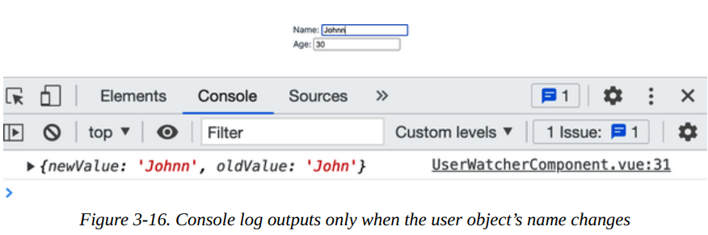

Puedes usar el enfoque de ruta delimitada por puntos para habilitar la observación de una propiedad hija específica, sin importar cuán anidada esté. Por ejemplo, si el usuario tiene esto:

```ts
type User = {
  name: string;
  age: number;
  address: {
    street: string;
    city: string;
    country: string;
    zip: string;
  };
}
```

Supón que necesitas observar cambios en `user.address.city`; puedes hacerlo usando `"user.address.city"` como nombre del watcher, y así sucesivamente. Al adoptar este enfoque, puedes evitar problemas de rendimiento no deseados en la observación profunda y reducir el alcance del watcher solo a las propiedades que necesitas.

#### Usando el método this.$watch()

En la mayoría de los casos, la opción `watch` es suficiente para manejar tus necesidades de observación. Sin embargo, hay escenarios donde no deseas habilitar ciertos watchers cuando no son necesarios. Por ejemplo, es posible que desees habilitar el watcher `user.address.city` solo cuando la propiedad `address` del objeto `user` no sea `null`. En este caso, puedes usar el método `this.$watch()` para crear el watcher condicionalmente al crear el componente.

El método `this.$watch()` acepta los siguientes parámetros:

- Nombre del dato objetivo a observar como string
- La función callback como manejador del watcher que se ejecutará cuando el valor del dato objetivo cambie

`this.$watch()` retorna una función que puedes llamar para detener el watcher. El código del Ejemplo 3-19 muestra cómo usar el método `this.$watch()` para crear un watcher que observe cambios en `user.address.city`.

```vue linenums="1" title="Example 3-19. Watcher que observa cambios en el campo city de la dirección del usuario"
<script lang="ts">
import { defineComponent } from "vue";
import type { WatchStopHandle } from "vue";

export default defineComponent({
  name: "UserWatcherComponent",
  data(): { user: User; stopWatchingAddressCity?: WatchStopHandle } {
    return {
      user: {
        name: "John",
        age: 30,
        address: {
          street: "123 Main St",
          city: "New York",
          country: "USA",
          zip: "10001",
        },
      },
      stopWatchingAddressCity: undefined, // (1)!
    };
  },
  created() {
    if (this.user.address) { // (2)!
      this.stopWatchingAddressCity = this.$watch(
        "user.address.city",
        (newValue: string, oldValue: string) => {
          console.log({ newValue, oldValue });
        }
      );
    }
  },
  beforeUnmount() {  
    if (this.stopWatchingAddressCity) { // (3)!
      this.stopWatchingAddressCity();
    }
  },
});
</script>
```

1. Define una propiedad `stopWatchingAddressCity` para almacenar la función de retorno del watcher.
2. Crea un watcher para `user.address.city` solo cuando la propiedad `address` del objeto `user` esté disponible.
3. Antes de desmontar el componente, ejecuta la función `stopWatchingAddressCity` para detener el watcher si corresponde.

Usando este enfoque, podemos limitar la cantidad de watchers innecesarios creados, como el watcher para `user.address.city` cuando `user.address` no existe.

A continuación, veremos otra característica interesante de Vue: el componente `slot`.

---

## El poder de los Slots

Construir un componente se trata de más que solo sus datos y lógica. A menudo queremos mantener el sentido y el diseño existente del componente, pero aún permitir que los usuarios modifiquen partes de la plantilla UI. Esta flexibilidad es crucial al construir una librería de componentes personalizables en cualquier framework.

Afortunadamente, Vue ofrece el componente `<slot>` para permitirnos reemplazar dinámicamente el diseño UI predeterminado de un elemento cuando sea necesario.

Por ejemplo, construyamos un componente de layout `ListLayout` para renderizar una lista de elementos, donde cada elemento tiene el siguiente tipo:

```ts
interface Item {
  id: number
  name: string
  description: string
  thumbnail?: string
}
```

Para cada elemento de la lista, por defecto, el componente layout debe renderizar su `name` y `description`, como se muestra en el Ejemplo 3-20.

```vue linenums="1" title="Example 3-20. Primera implementación de la plantilla del componente ListLayout"
<template>
  <ul class="list-layout">
    <li class="list-layout__item" v-for="item in items" :key="item.id">
      <div class="list-layout__item__name">{{ item.name }}</div>
      <div class="list-layout__item__description">{{ item.description }}</div>
    </li>
  </ul>
</template>
```

También definimos una lista de ejemplo de elementos para renderizar en `ListLayout` en su sección de script (Ejemplo 3-21).

```vue linenums="1" title="Example 3-21. Sección de script del componente ListLayout"

<script lang="ts">
import { defineComponent } from 'vue'

export default defineComponent({
  name: 'ListLayout',
  data(): { items: Item[] } {
    return {
      items: [
        {
          id: 1,
          name: "Item 1",
          description: "This is item 1",
          thumbnail: "https://res.cloudinary.com/mayashavin/image/upload/v1643005666/Demo/supreme_pizza",
        },
        {
          id: 2,
          name: "Item 2",
          description: "This is item 2",
          thumbnail: "https://res.cloudinary.com/mayashavin/image/upload/v1643005666/Demo/hawaiian_pizza",
        },
        {
          id: 3,
          name: "Item 3",
          description: "This is item 3",
          thumbnail: "https://res.cloudinary.com/mayashavin/image/upload/v1643005666/Demo/pina_colada_pizza",
        },
      ]
    }
  }
})
</script>
```

La Figura 3-17 muestra la UI renderizada por defecto de un solo elemento usando la plantilla anterior (Ejemplo 3-20) y los datos (Ejemplo 3-21).

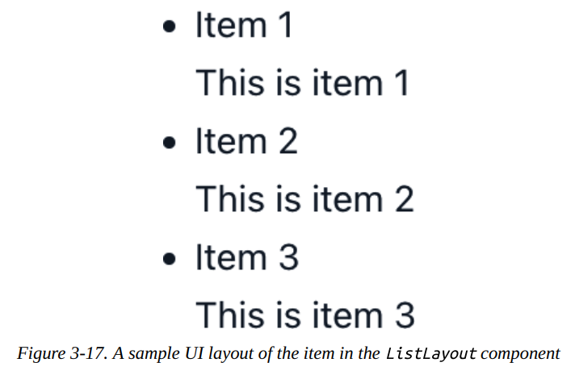

Basándonos en esta UI predeterminada, podemos ofrecer a los usuarios una opción para personalizar la UI de cada elemento. Para hacerlo, envolvemos el bloque de código dentro de un elemento `li` con un elemento `slot`, como se muestra en el Ejemplo 3-22.

```vue linenums="1" title="Example 3-22. Componente ListLayout con slot"
<template>
  <ul class="list-layout">
    <li class="list-layout__item" v-for="item in items" :key="item.id">
      <slot :item="item">
        <div class="list-layout__item__name">{{ item.name }}</div>
        <div class="list-layout__item__description">{{ item.description }}</div>
      </slot>
    </li>
  </ul>
</template>
```


Observa cómo vinculamos la variable `item` recibida en cada iteración de `v-for` al mismo atributo prop `item` del componente `slot` usando la sintaxis `:`. Al hacer esto, aseguramos que el slot proporcione acceso a los mismos datos `item` a sus descendientes.

!!! note

    El componente `slot` no comparte el mismo contexto de datos que su componente anfitrión (como `ListLayout`). Si deseas acceder a cualquier propiedad de datos del componente anfitrión, debes pasarla como prop al slot usando la sintaxis `v-bind`. Aprenderemos más sobre cómo pasar props a elementos anidados en "Componentes Anidados y Flujo de Datos en Vue".

Sin embargo, necesitamos más que tener `item` disponible para el contenido de la plantilla personalizada para que funcione. En el componente padre de `ListLayout`, agregamos la directiva `v-slot` a la etiqueta `<ListLayout>` para obtener acceso al `item` pasado a su componente `slot`, siguiendo la sintaxis a continuación:

```vue
<ListLayout v-slot="{ item }">
  <!-- Contenido de plantilla personalizada -->
</ListLayout>
```

Aquí usamos la sintaxis de desestructuración de objetos `{ item }` para crear una referencia de slot con ámbito (scoped slot) a la propiedad de datos a la que queremos acceder. Luego podemos usar `item` directamente en nuestro contenido de plantilla personalizada, como en el Ejemplo 3-23.

```js linenums="1" title="Example 3-23. Componiendo ProductItemList a partir de ListLayout"
<!-- ProductItemList.vue -->
<template>
  <div id="app">
    <ListLayout v-slot="{ item }">
      
      <div class="list-layout__item__name">{{ item.name }}</div>
    </ListLayout>
  </div>
</template>
```


En el Ejemplo 3-23, cambiamos la UI para mostrar solo una imagen thumbnail y el nombre del elemento. Puedes ver el resultado en la Figura 3-21.

Este ejemplo es el caso de uso más sencillo para el componente `slot` cuando queremos habilitar la personalización en un solo slot del elemento. Pero, ¿qué pasa con escenarios más complejos, como un componente de tarjeta de producto que contiene un thumbnail, el área de descripción principal y un área de acciones, cada una de las cuales requiere personalización? Para tal caso, aún podemos aprovechar el poder de los slots, con capacidad de nomenclatura.

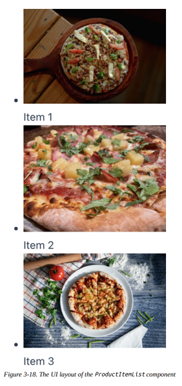

### Usando Slots Nombrados con Template Tag y v-slot

En el Ejemplo 3-22, solo habilitamos la personalización para la UI del nombre y descripción del elemento como un solo slot. Para dividir la personalización en varias secciones de slot para un thumbnail, el área de descripción principal y un footer de acciones, usamos `slot` con el atributo `name`, como en el Ejemplo 3-24.

```vue linenums="1" title="Example 3-24. Componente ListLayout con slots nombrados"
<template>
  <ul class="list-layout">
    <li class="list-layout__item" v-for="item in items" :key="item.id">
      <slot name="thumbnail" :item="item" />
      <slot name="main" :item="item">
        <div class="list-layout__item__name">{{ item.name }}</div>
        <div class="list-layout__item__description">{{ item.description }}</div>
      </slot>
      <slot name="actions" :item="item" />
    </li>
  </ul>
</template>
```

Asignamos a cada slot los nombres `thumbnail`, `main` y `actions`, respectivamente. Y para el slot `main`, agregamos una plantilla de contenido de respaldo para mostrar el nombre y la descripción del elemento.

Cuando queremos pasar contenido personalizado a un slot específico, envolvemos el contenido con una etiqueta `template`. Luego pasamos el nombre declarando el slot deseado (por ejemplo, `slot-name`) a la directiva `v-slot` del template, siguiendo la sintaxis:

```vue
<template v-slot:slot-name>
  <!-- Contenido personalizado -->
</template>
```

También podemos usar la sintaxis abreviada `#` en lugar de `v-slot:`:

```vue
<template #slot-name>
  <!-- Contenido personalizado -->
</template>
```

!!! note

    De aquí en adelante, usaremos la sintaxis `#` para denotar `v-slot` cuando se use con la etiqueta `template`.

Al igual que usar `v-slot` en la etiqueta del componente, también podemos dar acceso a los datos del slot:

```vue
<template #slot-name="mySlotProps">
  <!--<div> Datos del slot: {{ mySlotProps }}</div>-->
</template>
```

!!! warning "USANDO MÚLTIPLES SLOTS"

    Para múltiples slots, debes usar la directiva `v-slot` para cada etiqueta `template` relevante, y no en la etiqueta del componente. De lo contrario, Vue lanzará un error.

Volvamos a nuestro componente `ProductItemList` (Ejemplo 3-23) y refactorícelo para renderizar las siguientes secciones de contenido personalizado para el elemento del producto:

- Una imagen thumbnail
- Un botón de acción para agregar el producto al carrito

El Ejemplo 3-25 muestra cómo implementar eso usando `template` y `v-slot`.

```vue linenums="1" title="Example 3-25. Componiendo ProductItemList con slot nombrado"
<!-- ProductItemList.vue -->
<template>
  <div id="app">
    <ListLayout>
      <template #thumbnail="{ item }">
        
      </template>
      <template #actions>
        <div class="list-layout__item__footer">
          <button class="list-layout__item__footer__button">Add to cart</button>
        </div>
      </template>
    </ListLayout>
  </div>
</template>
```

El código da como resultado la salida mostrada en la Figura 3-19. 

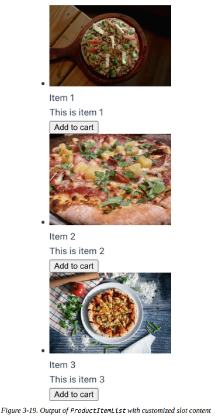

Y eso es todo. Estás listo para usar slots para personalizar tus componentes UI.

Con los slots, ahora puedes crear algunos layouts reutilizables básicos estándar para tu aplicación, como un layout de página con header y footer, un layout de panel lateral, o un componente modal que puede ser un diálogo o notificación. Entonces descubrirás lo útiles que son los slots para mantener tu código organizado y reutilizable.

!!! note

    Usar `slot` también significa que el navegador no aplicará todos los estilos con ámbito (scoped styles) definidos en el componente. Para habilitar esta funcionalidad, consulta "Aplicando Estilos con Ámbito al Contenido del Slot".

A continuación, aprenderemos cómo acceder a la instancia del componente montado o a un elemento DOM usando refs.

---

## Entendiendo Refs

Si bien Vue maneja la mayoría de las interacciones DOM por ti, para algunos escenarios puede que necesites acceder directamente a un elemento DOM dentro de un componente para manipulaciones adicionales. Por ejemplo, es posible que desees abrir un diálogo modal cuando el usuario hace clic en un botón o enfocar un campo de entrada específico al montar el componente. En tales casos, puedes usar el atributo `ref` para acceder a la instancia del elemento DOM objetivo.

`ref` es un atributo incorporado de Vue que te permite recibir una referencia directa a un elemento DOM o a una instancia hija montada. En la sección de plantilla, asignas el valor del atributo `ref` a un string que representa el nombre de referencia en el elemento objetivo. El Ejemplo 3-26 muestra cómo crear un `messageRef`, que se refiere al elemento DOM `input`.

```vue linenums="1" title="Example 3-26. Componente input con atributo ref asignado a messageRef"
<template>
  <div>
    <input type="text" ref="messageRef" placeholder="Enter a message" />
  </div>
</template>
```

Luego puedes acceder a `messageRef` en la sección de script para manipular el elemento `input` a través de la instancia `this.$refs.messageRef`. La instancia de referencia `messageRef` tendrá todas las propiedades y métodos del elemento `input`. Por ejemplo, puedes usar `this.$refs.messageRef.focus()` para enfocar el elemento `input` programáticamente.

!!! warning "ACCEDIENDO AL ATRIBUTO REF"

    El atributo `ref` solo es accesible después de montar el componente.

La instancia de referencia contiene todas las propiedades y métodos de un elemento DOM específico o de la instancia del componente hijo, dependiendo del tipo de elemento objetivo. En un escenario donde usas el atributo `ref` en un elemento iterado con `v-for`, la instancia de referencia será un array que contiene los elementos iterados sin orden.

Tomemos una lista de tareas, por ejemplo. Como muestra el Ejemplo 3-27, puedes usar el atributo `ref` para acceder a la lista de tareas.

```vue linenums="1" title="Example 3-27. Lista de tareas con atributo ref asignado a tasksRef"
<template>
  <div>
    <ul>
      <li v-for="(task, index) in tasks" :key="task.id" ref="tasksRef">
        {{title}} {{index}}: {{task.description}}
      </li>
    </ul>
  </div>
</template>

<script lang="ts">
import { defineComponent } from "vue";

export default defineComponent({
  name: "TaskListComponent",
  data() {
    return {
      tasks: [{
        id: 'task01',
        description: 'Buy groceries',
      }, {
        id: 'task02',
        description: 'Do laundry',
      }, {
        id: 'task03',
        description: 'Watch Moonknight',
      }],
      title: 'Task',
    };
  }
});
</script>
```

Una vez que Vue monta el `TaskListComponent`, puedes ver que `tasksRef` contiene tres elementos DOM `li` anidados en la propiedad `refs` de la instancia del componente, como se ve en la captura de pantalla de Vue Devtools en la Figura 3-20.

Ahora puedes usar `this.$refs.tasksRef` para acceder a la lista de elementos de tarea y realizar modificaciones adicionales cuando sea necesario.

!!! note

    `ref` también puede aceptar una función como su valor, agregando un prefijo `:` (`:ref`). La función acepta la instancia de referencia como su parámetro de entrada.

Hemos aprendido sobre el atributo `ref` y cómo puede ser útil en muchos desafíos del mundo real, como construir un sistema modal reutilizable (consulta "Implementando un Modal con Teleport y el Elemento `<dialog>`"). La siguiente sección explorará cómo crear y compartir configuraciones estándar entre componentes con mixins.

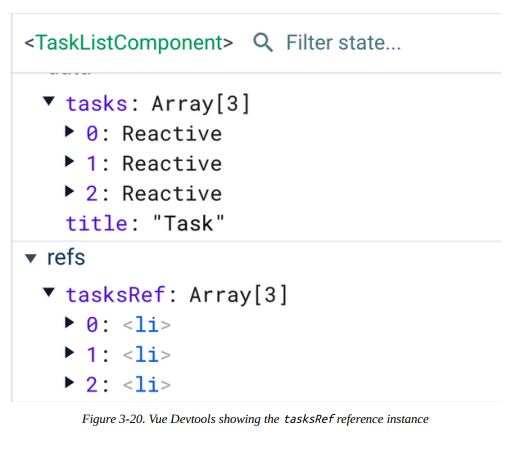

---

## Compartiendo Configuración de Componentes con Mixins

En la realidad, no es raro que algunos componentes compartan datos y comportamientos similares, como un componente de cafetería y un componente de restaurante formal. Ambos elementos comparten la lógica de hacer reservaciones y aceptar pagos, pero cada uno tiene características únicas. En tales escenarios, puedes usar la propiedad `mixins` para compartir las funcionalidades estándar entre estos dos componentes.

Por ejemplo, puedes crear un objeto `restaurantMixin` que contenga las funcionalidades estándar de los dos componentes, `DiningComponent` y `CafeComponent`, como en el Ejemplo 3-28.

```ts linenums="1" title="Example 3-28. Objeto mixin restaurantMixin"
/** mixins/restaurantMixin.ts */
import { defineComponent } from 'vue'

export const restaurantMixin = defineComponent({
  data() {
    return {
      menu: [],
      reservations: [],
      payments: [],
      title: 'Restaurant',
    };
  },
  methods: {
    makeReservation() {
      console.log("Reservation made");
    },
    acceptPayment() {
      console.log("Payment accepted");
    },
  },
  created() {
    console.log(`Welcome to ${this.title}`);
  }
});
```

Luego puedes usar el objeto `restaurantMixin` en la propiedad `mixins` de `DiningComponent`, como se ve en el Ejemplo 3-29.

```vue linenums="1" title="Example 3-29. Usando la propiedad mixins de restaurantMixin en DiningComponent"
<!-- components/DiningComponent.vue -->
<template>
  <h1>{{title}}</h1>
  <button @click="getDressCode">getDressCode</button>
  <button @click="makeReservation">Make a reservation</button>
  <button @click="acceptPayment">Accept a payment</button>
</template>

<script lang='ts'>
import { defineComponent } from 'vue'
import { restaurantMixin } from '@/mixins/restaurantMixin'

export default defineComponent({
  name: 'DiningComponent',
  mixins: [restaurantMixin],
  data() {
    return {
      title: 'Dining',
      menu: [
        { id: 'menu01', name: 'Steak' },
        { id: 'menu02', name: 'Salad' },
        { id: 'menu03', name: 'Pizza' },
      ],
    };
  },
  methods: {
    getDressCode() {
      console.log("Dress code: Casual");
    },
  },
  created() {
    console.log('DiningComponent component created!');
  }
});
</script>
```

El Ejemplo 3-30 muestra el `CafeComponent` similar.

```vue linenums="1" title="Example 3-30. Usando la propiedad mixins de restaurantMixin en CafeComponent"
<!-- components/CafeComponent.vue -->
<template>
  <h1>{{title}}</h1>
  <p>Open time: 8am - 4pm</p>
  <ul>
    <li v-for="menuItem in menu" :key="menuItem.id">
      {{menuItem.name}}
    </li>
  </ul>
  <button @click="acceptPayment">Pay</button>
</template>

<script lang='ts'>
import { defineComponent } from 'vue'
import { restaurantMixin } from '@/mixins/restaurantMixin'

export default defineComponent({
  name: 'CafeComponent',
  mixins: [restaurantMixin],
  data() {
    return {
      title: 'Cafe',
      menu: [{
        id: 'menu01',
        name: 'Coffee',
        price: 5,
      }, {
        id: 'menu02',
        name: 'Tea',
        price: 3,
      }, {
        id: 'menu03',
        name: 'Cake',
        price: 7,
      }],
    };
  },
  created() {
    console.log('CafeComponent component created!');
  }
});
</script>
```

Al crear los componentes, el motor de Vue fusiona la lógica del mixin en el componente, dando prioridad a la declaración de datos del componente. En los Ejemplos 3-29 y 3-30, el `DiningComponent` y el `CafeComponent` tendrán las mismas propiedades (`menu`, `reservations`, `payments` y `title`), pero con diferentes valores. Además, los métodos y hooks declarados en `restaurantMixin` estarán disponibles para ambos componentes.

Es similar al patrón de herencia, aunque el componente no sobrescribe el comportamiento de los hooks del mixin. En su lugar, el motor de Vue llama primero a los hooks del mixin y luego a los hooks del componente.

Cuando Vue monta el `DiningComponent`, verás la salida en la Figura 3-21 en la consola del navegador.

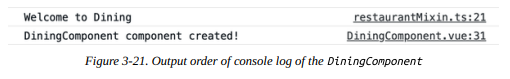

Del mismo modo, cuando Vue monta el `CafeComponent`, verás la salida en la Figura 3-22 en la consola del navegador.

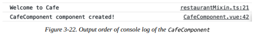

Observa que el valor de `title` ha cambiado entre los dos componentes, mientras que Vue ejecuta primero el hook `created` de `restaurantMixin`, seguido del declarado en el elemento mismo.

!!! note

    El orden de fusión y ejecución de los hooks para múltiples mixins sigue el orden del array `mixins`. Vue siempre llama a los hooks del componente al final. Considera este orden al juntar múltiples mixins.

Si abres Vue Devtools, verás que `restaurantMixin` no es visible, y el `DiningComponent` y `CafeComponent` aparecen con sus propias propiedades de datos, como se muestra en las Figuras 3-23 y 3-24.

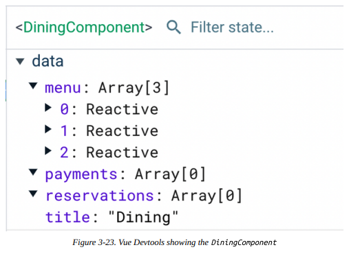

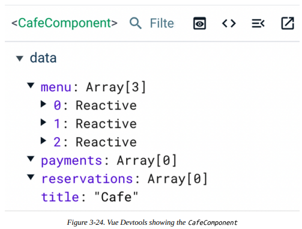

Los mixins son excelentes para compartir lógica común entre componentes y mantener tu código organizado. Sin embargo, demasiados mixins pueden confundir a otros desarrolladores al momento de entender y depurar el código, y en la mayoría de los casos se consideran una mala práctica. Recomendamos validar tu caso de uso antes de elegir mixins sobre alternativas, como la Composition API (Capítulo 5).

En este punto, hemos explorado cómo componer la lógica de los componentes usando características avanzadas en las secciones de template y script. A continuación, aprendamos cómo hacer hermoso tu componente con las características de estilo integradas de Vue en la sección `style`.

---

## Estilos con Ámbito en Componentes (Scoped Styles)

Al igual que en una estructura de página HTML regular, podemos definir estilos CSS para un componente SFC usando la etiqueta `<style>`:

```css
<style>
  h1 {
    color: red;
  }
</style>
```

La sección `<style>` generalmente viene al final del orden de un componente SFC de Vue y puede aparecer múltiples veces. Al montar el componente en el DOM, el motor de Vue aplica los estilos CSS definidos dentro de la etiqueta `<style>` a todos los elementos o selectores DOM coincidentes dentro de la aplicación. En otras palabras, todas las reglas CSS que aparecen en el `<style>` de un componente se aplican globalmente una vez montadas. Tomemos el `HeadingComponent` mostrado en el Ejemplo 3-31, que renderiza un título con algunos estilos.

```vue linenums="1" title="Example 3-31. Usando la etiqueta <style> en HeadingComponent"
<template>
  <h1 class="heading">{{title}}</h1>
  <p class="description">{{description}}</p>
</template>

<script lang='ts'>
export default {
  name: 'HeadingComponent',
  data() {
    return {
      title: 'Welcome to Vue Restaurant',
      description: 'A Vue.js project to learn Vue.js',
    };
  },
};
</script>

<style>
  .heading {
    color: #178c0e;
    font-size: 2em;
  }
  .description {
    color: #b76210;
    font-size: 1em;
  }
</style>
```

En el Ejemplo 3-31, creamos dos selectores de clase CSS: `heading` y `description` para los elementos `h1` y `p` del componente, respectivamente. Cuando Vue monta el componente, el navegador pintará estos elementos con los estilos apropiados, como se ve en la Figura 3-25.

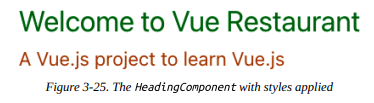

El Ejemplo 3-32 muestra cómo agregar un elemento `span` con la misma clase `heading` fuera de `HeadingComponent` en el componente padre `App.vue`.

```vue linenums="1" title="Example 3-32. Agregando el mismo selector de clase al componente padre App.vue"
<!-- App.vue -->
<template>
  <section class="wrapper">
    <HeadingComponent />
    <span class="heading">This is a span element in App.vue component</span>
  </section>
</template>
```

El navegador entonces sigue aplicando los mismos estilos al elemento `span`, como se muestra en la Figura 3-26.

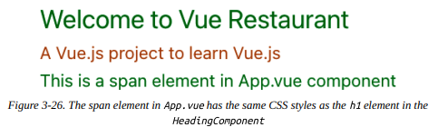


Pero si no usamos el `HeadingComponent`, o si no existe aún en la aplicación en tiempo de ejecución, el elemento `span` no tendrá las reglas CSS del selector de clase `heading`.

Para evitar tal escenario y tener un mejor control de las reglas y selectores de estilo, Vue ofrece una característica única: el atributo `scoped`. Con la etiqueta `<style scoped>`, Vue asegura que las reglas CSS se apliquen solo a los elementos relevantes dentro del componente y no se filtren al resto de la aplicación. Vue logra este mecanismo realizando los siguientes pasos:

1. Agrega un atributo de datos generado aleatoriamente en la etiqueta del elemento objetivo con la sintaxis de prefijo `data-v`.
2. Transforma los selectores CSS definidos en la etiqueta `<style scoped>` para incluir el atributo de datos generado.

Veamos cómo funciona esto en la práctica. En el Ejemplo 3-33, agregamos el atributo `scoped` a la etiqueta `<style>` del `HeadingComponent`.

```vue linenums="1" title="Example 3-33. Agregando el atributo scoped a la etiqueta <style> de HeadingComponent"
<!-- HeadingComponent.vue -->
<!--...-->
<style scoped>
  .heading {
    color: #178c0e;
    font-size: 2em;
  }
  .description {
    color: #b76210;
    font-size: 1em;
  }
</style>
```

El elemento `span` definido en `App.vue` (Ejemplo 3-32) ya no tendrá los mismos estilos CSS que el elemento `h1` en `HeadingComponent`, como se muestra en la Figura 3-27.

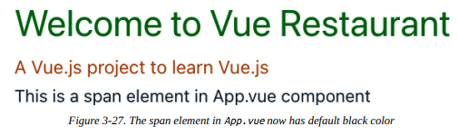

Cuando abres la pestaña Elements en las Herramientas de Desarrollo del navegador, puedes ver que los elementos `h1` y `p` ahora tienen el atributo `data-v-xxxx`, como se muestra en la Figura 3-28.

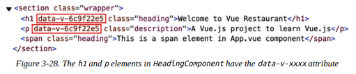

Y si seleccionas el elemento `h1` y observas sus estilos en el panel derecho, puedes ver que el selector CSS `.heading` se ha convertido en `.heading[data-v-xxxx]`, como se muestra en la Figura 3-29.

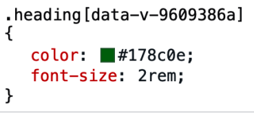

Recomiendo encarecidamente que comiences a trabajar con el atributo `scoped` en tus componentes como un buen hábito de codificación para evitar errores CSS no deseados cuando tu proyecto crezca.

!!! note

    El navegador sigue la especificidad CSS al decidir en qué orden aplicar los estilos. Debido a que el mecanismo scoped de Vue usa selectores de atributo `[data-v-xxxx]`, usar el selector `.heading` por sí solo no es suficiente para sobrescribir los estilos del componente desde el padre.

#### Aplicando CSS a un Componente Hijo en Estilos con Ámbito

A partir de Vue 3.x, puedes sobrescribir o extender los estilos de un componente hijo desde el padre con un estilo scoped usando la pseudo-clase `:deep()`. Por ejemplo, como muestra el Ejemplo 3-34, podemos sobrescribir los estilos scoped del elemento párrafo `p` en el `HeadingComponent` desde su padre `App`.

```vue linenums="1" title="Example 3-34. Sobrescribiendo los estilos scoped del elemento p en HeadingComponent desde App"
<!-- App.vue -->
<template>
  <section class="wrapper">
    <HeadingComponent />
    <span class="heading">This is a span element in App.vue component</span>
  </section>
</template>

<style scoped>
  .wrapper :deep(p) {
    color: #000;
  }
</style>
```

El elemento `p` en el `HeadingComponent` tendrá el color negro en lugar de su color scoped `#b76210`, como se muestra en la Figura 3-30.

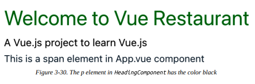

!!! note

    El navegador aplicará las reglas CSS recién definidas a cualquier elemento `p` anidado en cualquier componente hijo de `App` y sus hijos.

#### Aplicando Estilos con Ámbito al Contenido del Slot

Por diseño, cualquier estilo definido en la etiqueta `<style scoped>` es relevante solo para la plantilla predeterminada del componente mismo. Vue no podrá transformar ningún contenido sloteado para incluir el atributo `data-v-xxxx`. Para estilizar cualquier contenido sloteado, puedes usar la pseudo-clase `:slot([CSS selector])` o crear una sección de estilo dedicada para ellos a nivel del padre y mantener el código organizado.

#### Accediendo al Valor de Datos de un Componente en la Etiqueta Style con v-bind()

A menudo necesitamos acceder al valor de los datos del componente y vincular ese valor a una propiedad CSS válida, como cambiar el modo oscuro o claro o el color del tema de una aplicación según la preferencia del usuario. Para tales casos de uso, usamos la pseudo-clase `v-bind()`.

`v-bind()` acepta la propiedad de datos del componente y expresiones JavaScript como string para su único argumento. Por ejemplo, podemos cambiar el color del elemento `h1` en el `HeadingComponent` basándonos en el valor de la propiedad de datos `titleColor`, como se muestra en el Ejemplo 3-35.

```vue linenums="1" title="Example 3-35. Cambiando el color del elemento h1 basado en el valor de titleColor"
<!-- HeadingComponent.vue -->
<template>
  <h1 class="heading">{{title}}</h1>
  <p class="description">{{description}}</p>
</template>

<script lang='ts'>
export default {
  //...
  data() {
    return {
      //...
      titleColor: "#178c0e",
    };
  },
};
</script>

<style scoped>
  .heading {
    color: v-bind(titleColor);
    font-size: 2em;
  }
</style>
```

La pseudo-clase `v-bind()` luego transforma el valor de la propiedad de datos `titleColor` en una variable CSS hasheada en línea, como se muestra en la Figura 3-31.

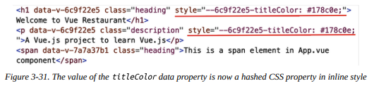

Abramos la pestaña Elements en las Herramientas de Desarrollo del navegador y observemos los estilos del elemento. Puedes ver que la propiedad `color` generada para el selector `.heading` se mantiene estática y tiene el mismo valor que la propiedad CSS hasheada desarrollada de `titleColor` (Figura 3-32).

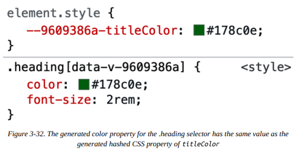

`v-bind()` ayuda a recuperar el valor de un dato del componente y luego vincular la propiedad CSS deseada a ese valor dinámico. Sin embargo, esto es solo vinculación unidireccional. Si deseas recuperar los estilos CSS definidos en la plantilla para vincularlos a los elementos de la plantilla, necesitas usar Módulos CSS, que cubriremos en la siguiente sección.

---

## Estilizando Componentes con Módulos CSS

Otra alternativa para delimitar tus estilos CSS por componente es usar Módulos CSS. Los Módulos CSS son un enfoque que te permite escribir estilos CSS regularmente y luego consumirlos como un objeto JavaScript (módulo) en nuestras secciones de plantilla y script.

Para comenzar a usar Módulos CSS en un componente SFC de Vue, debes agregar el atributo `module` a la etiqueta `style`, como se muestra en nuestro `HeadingComponent` en el Ejemplo 3-36.

```vue linenums="1" title="Example 3-36. Usando Módulos CSS en HeadingComponent"
<!-- HeadingComponent.vue -->
<style module>
  .heading {
    color: #178c0e;
    font-size: 2em;
  }
  .description {
    color: #b76210;
    font-size: 1em;
  }
</style>
```

Ahora tendrás acceso a estos selectores CSS como campos de un objeto de propiedad `$style` del componente. Podemos eliminar los nombres de clase estáticos `heading` y `description` asignados para `h1` y `p`, respectivamente, en la sección de plantilla. En su lugar, vincularemos las clases de estos elementos a los campos relevantes del objeto `$style` (Ejemplo 3-37).

```vue linenums="1" title="Example 3-37. Vinculando clases dinámicamente con el objeto $style"
<!-- HeadingComponent.vue -->
<template>
  <h1 :class="$style.heading">{{title}}</h1>
  <p :class="$style.description">{{description}}</p>
</template>
```

La salida en el navegador sigue siendo la misma que la Figura 3-27. Sin embargo, al observar los elementos relevantes en la pestaña Elements de las Herramientas de Desarrollo del navegador, verás que Vue ha hasheado los nombres de clase generados para mantener los estilos delimitados dentro del componente, como en la Figura 3-33.

Adicionalmente, puedes renombrar el objeto de estilo CSS `$style` asignando un nombre al atributo `module`, como se muestra en el Ejemplo 3-38.

```vue linenums="1" title="Example 3-38. Renombrando el objeto de estilo CSS $style a headerClasses"
<!-- HeadingComponent.vue -->
<style module="headerClasses">
  .heading {
    color: #178c0e;
    font-size: 2em;
  }
  .description {
    color: #b76210;
    font-size: 1em;
  }
</style>
```

Y en la sección de plantilla, puedes vincular las clases de los elementos `h1` y `p` al objeto `headerClasses` en su lugar (Ejemplo 3-39).

```vue linenums="1" title="Example 3-39. Vinculando clases dinámicamente con el objeto headerClasses"
<!-- HeadingComponent.vue -->
<template>
  <h1 :class="headerClasses.heading">{{title}}</h1>
  <p :class="headerClasses.description">{{description}}</p>
</template>
```

!!! note

    Si estás usando `<script setup>` o la función `setup()` en tu componente (Capítulo 5), puedes usar el hook `useCssModule()` para acceder a la instancia del objeto de estilo. Esta función acepta el nombre del objeto de estilo como su único argumento.

El componente ahora tiene un diseño más aislado que cuando se usaba el atributo `scoped` en la etiqueta `style`. El código se ve más organizado, y es más difícil sobrescribir los estilos de este componente desde afuera ya que Vue hashea los selectores CSS relevantes aleatoriamente. Sin embargo, dependiendo de los requisitos de tu proyecto, un enfoque puede ser mejor que el otro, o podría ser crucial combinar ambos atributos `scoped` y `module` para lograr el resultado deseado.

## Resumen

En este capítulo, aprendimos cómo crear un componente Vue en el estándar SFC y usar `defineComponent()` para habilitar completamente el soporte de TypeScript para la aplicación Vue. También aprendimos a usar slots para crear un componente reutilizable con estilos aislados y configuraciones de mixin compartidas en diferentes contextos. Hemos explorado más a fondo la composición de componentes usando los hooks del ciclo de vida del componente, propiedades computadas, métodos y watch en la Options API. A continuación, construiremos sobre estos fundamentos para crear eventos personalizados y desarrollar las interacciones entre componentes con los patrones provide/inject.

